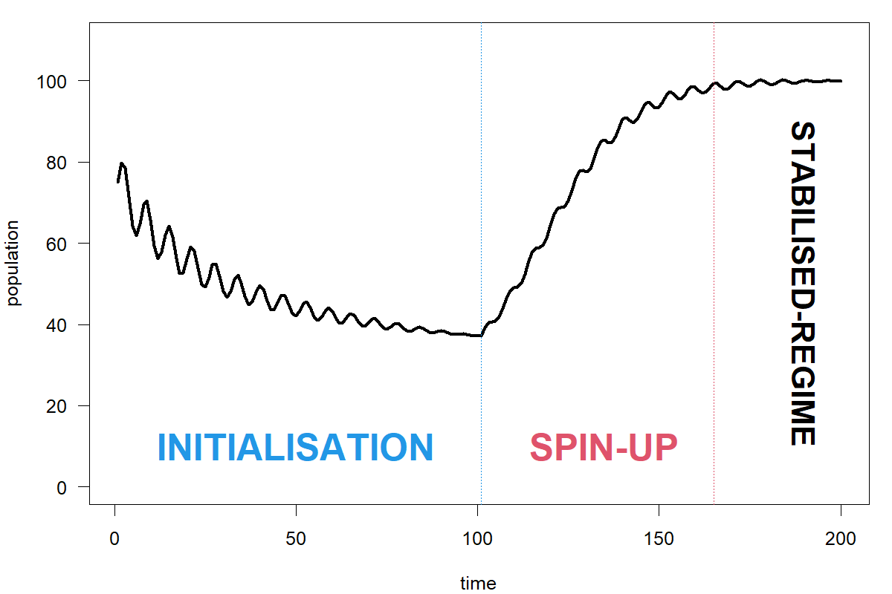
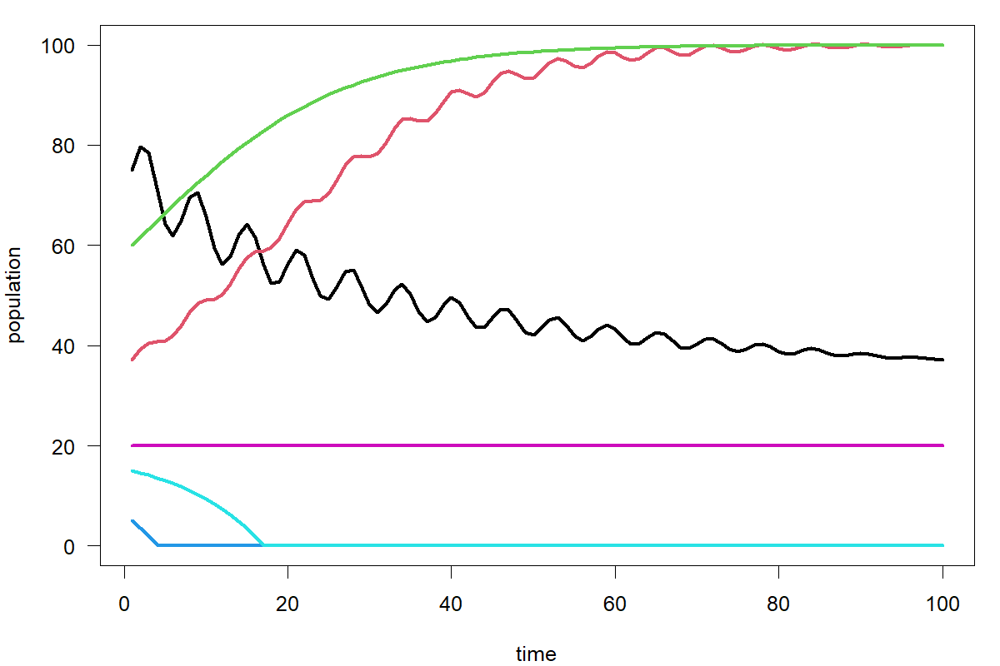
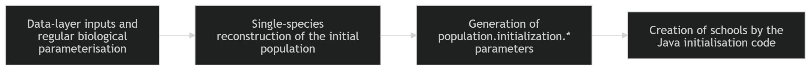
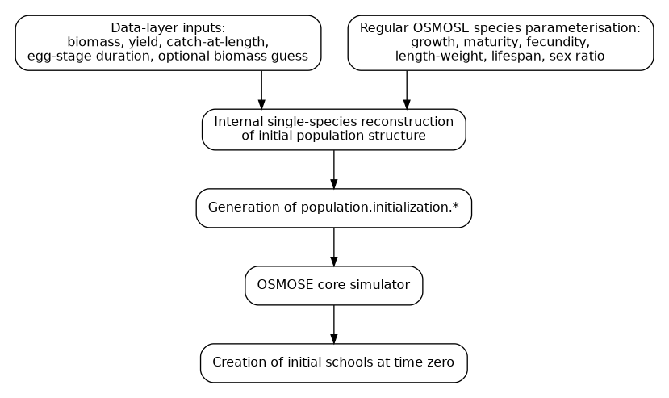

```{=latex}
\clearpage
```

# Summary

Initialisation is a fundamental part of any OSMOSE simulation. Because OSMOSE is a stochastic, school-based, multispecies model, the initial condition is not just a total biomass by species. It must define, directly or indirectly, the demographic and ecological structure from which the simulation begins. In practice, this means specifying or reconstructing enough information to determine total biomass, age or size structure, the number of schools used to represent the population, trophic level, and, depending on the method, spatial distribution. Initialisation therefore conditions the early demographic and trophic dynamics of the model and can influence not only the length of the transient adjustment, but also the long-term regime eventually reached by the simulation.

This point is closely related to, but distinct from, spin-up. Initialisation is the construction of the starting state at simulation time zero. Spin-up is the subsequent adjustment phase during which the model evolves from that imposed state towards a regime more consistent with its equations, parameterisation, and forcing. In some applications, especially steady-state ones, spin-up is a central part of the workflow. In interannual simulations, however, the early transient dynamics are often part of the target of the analysis, so a satisfactory initial condition is one that already captures the relevant demographic and ecological structure at the beginning of the run.

OSMOSE 4.4 currently supports three main conceptual routes for initialisation. The preferred default for most applications is **reconstructed population-level initialisation**. In this workflow, the user provides a data layer, typically biomass, yield, catch-at-length, and a small number of additional inputs, together with the regular species parameterisation already required by OSMOSE. These inputs are used to reconstruct a plausible class-based initial population structure for each focal species. The result is written as a `population.initialization.*` block describing total biomass, biomass allocation among classes, size boundaries, ages, trophic levels, and the number of schools per class. The OSMOSE core simulator then expands this population-level description into the school-based runtime state used at the beginning of the simulation.

The second route is **direct school-based initialisation**. Here, the initial condition is provided explicitly as a restart-like netCDF file referenced through `population.initialization.file`. This file contains one record per school, including species identity, position, abundance, age, length, weight, and trophic level. This is the most explicit and direct representation of the initial state, and it is particularly suitable for restart workflows, coupling applications, or cases where a school-based state already exists. Its main limitation is practical: preparing a valid school-level initial-condition file can be demanding when such a file is not already available.

The third route is **egg seeding initialisation**. This is a legacy, reproduction-based mechanism implemented within the reproduction process of the OSMOSE core simulator. It does not provide a complete initial state directly. Instead, it can generate eggs artificially from a user-defined seeding biomass or abundance when no eggs are produced by mature schools and the simulation is still within the configured seeding period. In practice, this route can serve two related purposes: it can help establish the first reproducing population when mature individuals are initially absent, and it can also act as a safeguard against irreversible collapse by maintaining a minimal reproductive source. It is therefore useful in some situations, but it offers much less direct control over the resulting initial state than the two explicit representations above.

A key practical distinction in OSMOSE 4.4 is the difference between three representations that may appear in the same workflow. First, there is the **data layer**, that is, the observational and biological information used to reconstruct an initial state. Second, there is the generated **population-level initialisation block**, namely the `population.initialization.*` parameters. Third, there is the final **school-based runtime state** created by the OSMOSE core simulator. These are not interchangeable objects, and much of the practical confusion around initialisation comes from moving between them without keeping their roles distinct.

For most applications in OSMOSE 4.4, the recommended workflow is therefore clear: use reconstructed population-level initialisation, inspect the generated `population.initialization.*` block explicitly, and archive both the upstream data-layer inputs and the generated initialisation block. Direct school-based initialisation should be used when an explicit school-level state is already available or required, and egg seeding should be regarded as a complementary route for specialised cases where parameter-free or anti-collapse behaviour is needed. In all cases, the central principle is the same: the initial condition is part of the model definition, and its adequacy should be assessed in relation to the purpose of the simulation, not treated as a purely technical detail.

```{=latex}
\clearpage
```

# 1. Introduction

Initialisation is a fundamental part of any OSMOSE simulation. Before the model can simulate growth, mortality, reproduction, movement, predation, and fishing, it must be provided with a starting ecological state. In a school-based, stochastic, multispecies model such as OSMOSE, that starting state is not a trivial quantity. It is not enough to specify only a total biomass by species. The model requires a representation of how populations are distributed across demographic structure and, depending on the method, across schools and space as well.

The purpose of this document is to provide a technical description of the initialisation module in OSMOSE 4.4 and, at the same time, practical documentation for users who need to configure it. The initialisation module has evolved over time, and the current implementation combines methods developed at different stages of the model history. Some are legacy routes retained for backward compatibility or for specific use cases. Others, especially reconstructed population-level initialisation, now provide a more practical and coherent default workflow for most applications.

This document therefore has four main objectives.

First, it explains the conceptual role of initial conditions in OSMOSE and why they matter for the behaviour of the model.

Second, it describes the initialisation methods currently implemented in OSMOSE 4.4, including their conceptual logic, their main differences, and their practical role in the modelling workflow.

Third, it documents the parameters used by these methods, distinguishing carefully between the different layers of configuration involved in the current implementation.

Fourth, it provides practical guidance to users on how to choose an initialisation route, how to set the relevant parameters correctly, and what checks should be performed before accepting an initial state for simulation.

A central theme of the document is the distinction between different representations of the initial state. OSMOSE 4.4 supports direct school-level initialisation, in which the starting schools are provided explicitly through a restart-like file; reconstructed population-level initialisation, in which a class-based population state is reconstructed and then translated into schools by the OSMOSE core simulator; and egg seeding initialisation, in which early population establishment can emerge indirectly through seeded reproduction. These are not merely different file formats. They correspond to different practical and conceptual ways of specifying the starting state of the model.

Among these routes, reconstructed population-level initialisation is the most suitable default workflow for many ordinary applications in OSMOSE 4.4. It uses standard species parameterisation together with biomass and fishery information to generate a coherent population-level starting state, without requiring the user to build a full school-level initial-condition file. For this reason, the document gives particular attention to this method while still documenting the other implemented routes in full.

At the same time, the purpose of this document is descriptive rather than prescriptive in a narrow sense. It aims to document the OSMOSE 4.4 implementation as it currently exists. This is especially important because the initialisation module has accumulated extensions over time, particularly to broaden the applicability of reconstructed population-level initialisation to more data-poor situations. Some aspects of the present configuration structure are therefore historical and may not reflect the cleanest possible design.

For that reason, this document should also be read as documentation of the current state of the codebase prior to future redesign. A more systematic recoding of the initialisation module is planned for a later release, but the need to document the current implementation remains essential. Users of OSMOSE 4.4 require a clear account of what the available methods are, how they operate, and how their parameters should be interpreted in practice.

The remainder of the document is organised as follows. Section 2 introduces the conceptual background of initialisation in OSMOSE. Section 3 provides an overview of the methods currently implemented. Section 4 describes reconstructed population-level initialisation in detail, from its data layer and internal reconstruction procedure to the generation of the `population.initialization.*` block and its use by the OSMOSE core simulator. Section 5 documents the other implemented methods, namely egg seeding initialisation, direct school-level initialisation, and restart-derived generation of population-level initialisation inputs. Section 6 provides user guidance and parameter documentation. Section 7 discusses limitations of the OSMOSE 4.4 implementation and the rationale for future recoding. 

# 2. Conceptual background

Initialisation is not a minor technical step in OSMOSE. It is the process by which the model is given a starting ecological state from which all subsequent dynamics emerge. Because OSMOSE is stochastic, school-based, size-structured, and multispecies, the initial state cannot be reduced to a single biomass number per species. It must define, explicitly or implicitly, how biomass is distributed across ages, sizes, schools, and space, and how those elements enter the modelled life cycle from the first simulated time step.

This section introduces the main conceptual ideas needed to understand the implemented initialisation methods described later in the document. Its purpose is not to document any particular parameter, but to clarify what an initial condition means in OSMOSE, why it matters, and why practical initialisation methods are needed.

## 2.1. Initial conditions in ecosystem and population models

In any dynamic model, the initial condition is the state of the system at the beginning of the simulation. Once the model is started, all later states depend jointly on the model structure, the parameter values, the external forcing, and this initial state. Two runs with identical equations, parameters, and forcing can therefore produce different trajectories if they start from different initial conditions.

In principle, the initial condition should describe all state variables that are needed to start the simulation. In simple population models, this may mean specifying only abundance or biomass. In more structured models, it may also require the distribution of the population across ages, sizes, stages, or space. In ecosystem models, the problem becomes broader still, because several populations interact simultaneously and their initial states must be specified in a mutually coherent way.

For this reason, initialisation should be understood as part of the model definition rather than as a purely technical pre-processing step. A poor or inconsistent initial condition can generate unrealistic early transients, delay convergence towards a meaningful simulation regime, or even direct the system towards qualitatively different trajectories.

{#fig:initial-conditions-matter fig-align="center"}

## 2.2. Working definitions

The terminology used around model initialisation is not always fully consistent across fields. In ocean and climate modelling, some terms have long-established technical meanings [@ouranosNdInitializing; @thornton2005spinup], whereas in ecosystem modelling they are often used more loosely or in a more application-dependent way. In this document, the following working definitions are adopted and interpreted in the context of ecosystem models such as OSMOSE.

**Initial condition** refers to the state of the model at simulation time zero [@ouranosNdInitializing; @zhang2005enso]. In OSMOSE, this is not limited to total biomass by species. It includes, explicitly or implicitly, the demographic and ecological structure required to start the simulation, such as biomass distribution across age or size, the number of schools, trophic level, and, depending on the method, spatial position.

**Initialisation** refers to the process of choosing, constructing, or reconstructing that initial condition. Depending on the application, these starting values may come from observations, climatologies, previous model runs, simplified assumptions, or derived state estimates [@ouranosNdInitializing; @seferian2016cmip5]. In ecosystem models, this may also involve reconstructing a structured population state from partial biological and observational information rather than specifying every model entity directly.

**Transient dynamics** refer to the model behaviour that arises because the simulation begins from a particular initial condition that is not yet fully adjusted to the model structure, parameterisation, and forcing [@hewitt2016spinup; @seferian2016cmip5]. In ecosystem models, these transients may involve changes in abundance, demographic structure, trophic interactions, or spatial occupation as the system reorganises from its imposed starting state.

**Spin-up** refers to the adjustment phase during which the model evolves away from the imposed initial state and towards a regime that is dynamically consistent with its equations, parameter values, and forcing [@hewitt2016spinup; @ouranosNdInitializing; @thornton2005spinup]. In ecosystem models, spin-up often involves the establishment of a coherent age or size structure, trophic organisation, and reproductive regime. The duration of spin-up depends on the variables of interest and on how close the initial state is to the regime implied by the model.

**Equilibrium** should not be understood here as a perfectly constant state. In ecosystem models, it is more useful to define equilibrium as a regime in which the long-term tendencies of the variables relevant to the analysis have become sufficiently small for the intended purpose. Shorter-timescale variability may still remain [@thornton2005spinup; @seferian2016cmip5].

**Statistical equilibrium** is the appropriate concept when the model remains variable through time. In that case, what matters is not that every variable becomes constant, but that the mean behaviour, variance, or broader distribution of the simulated state becomes sufficiently stable on the timescales relevant to the analysis [@thornton2005spinup; @ouranosNdInitializing].

**Quasi-equilibrium** refers to a practical rather than absolute notion of equilibrium. A model can be considered to be in quasi-equilibrium when the remaining drift is small enough that it no longer compromises the scientific objective of the simulation, even if some slow adjustment is still present [@seferian2016cmip5; @lavingullon2023timeslices].

**Drift** refers to the residual systematic change that remains because the model has not fully adjusted, or because some part of the imposed starting state, forcing, or coupled structure is not fully consistent with the model’s own preferred regime [@hewitt2016spinup; @seferian2016cmip5]. In ecosystem models, drift may appear as gradual changes in biomass, age structure, trophic organisation, or other slow state variables.

**Memory of the initial condition** refers to the extent to which the simulated state still reflects the imposed starting configuration. This memory is variable-specific. Fast components may lose it quickly, whereas slow demographic, trophic, spatial, or biogeochemical structures may retain it for much longer [@ouranosNdInitializing; @seferian2016cmip5; @lavingullon2023timeslices].

**Attractor** is used here in a broad dynamical sense to denote the regime towards which the model tends under a given set of equations, parameters, and forcing. In practice, this may correspond to a stable equilibrium, a fluctuating statistical regime, or, in some cases, collapse. In this sense, saying that a model “forgets” its initial condition is only meaningful if different initial conditions converge towards the same attractor [@thornton2005spinup; @seferian2016cmip5].

**Adequate spin-up** is therefore variable-specific and question-specific. A simulation is adequately spun up when the remaining influence of the initial condition is small enough for the variables, timescales, and processes relevant to the problem being studied [@thornton2005spinup; @seferian2016cmip5; @lavingullon2023timeslices].

These definitions are especially useful for distinguishing steady-state and interannual applications. In a steady-state application, the initial condition mainly serves to place the model within reach of the regime of interest, and spin-up is a central part of the workflow. In an interannual simulation, by contrast, the early transient dynamics are often themselves part of the target of the analysis. In that case, a satisfactory initial condition is one that already captures the relevant demographic and ecological structure at the start of the simulation [@ouranosNdInitializing; @seferian2016cmip5].

## 2.3. Initialisation in a stochastic, school-based model

The initialisation problem is especially important in OSMOSE because the model does not represent populations as continuous deterministic state variables. Instead, focal species are represented as collections of schools, and each school carries its own state information, including species identity, abundance, age, length, weight, trophic level, and position.

As a result, the initial state of a population in OSMOSE is not just a collection of biomass values for every species. It is a distribution of biomass among many discrete entities, the super-individuals or schools, each of which will undergo growth, mortality, movement, predation, reproduction, and fishing as the simulation unfolds. This means that the same total biomass can correspond to very different effective initial states, depending on how that biomass is allocated among sizes, ages, schools, and locations.

Stochasticity reinforces this point. In a stochastic model, the realised trajectory depends not only on expected quantities but also on the specific configuration of the simulated entities. In OSMOSE, the initial condition is therefore better understood as a structured representation of a population state, not as a single deterministic configuration. This is one of the main reasons why initialisation matters so strongly in practice.

## 2.4. Initial conditions versus spin-up

The need for initialisation is closely related to, but not identical with, the idea of spin-up. In modelling practice, a spin-up period is a preliminary simulation phase during which the model is allowed to adjust from its starting state towards a more internally consistent regime under the chosen forcing and parameters [@hewitt2016spinup; @thornton2005spinup].

Spin-up is often useful because the initial condition supplied by the user is rarely a perfect representation of the dynamic state implied by the model. Even when biomass or demographic structure is approximately correct, the detailed balance between growth, mortality, reproduction, predation, and fishing may require some time to stabilise. Early simulation years can therefore reflect adjustment to the initial condition as much as the processes of real interest.

However, spin-up does not remove the importance of initialisation. The duration and behaviour of the spin-up depend on the starting state, and different initial conditions can lead to different transients and, in some cases, to different long-term regimes. Starting closer to a realistic internal state may shorten the adjustment period and improve the usefulness of the early simulation years. Starting from an inconsistent or poorly structured state may instead generate long or misleading transients.

In other words, spin-up is not a substitute for initialisation. It is a way to let the model adjust from the initial state that has been chosen.

{#fig:init-spinup-regime fig-align="center"}

The distinction between initialisation and spin-up is especially important when comparing simulation objectives. In a steady-state application, the main purpose of the initial condition may simply be to place the system within reach of the regime of interest, and spin-up is then a central part of the workflow. In an interannual simulation, by contrast, the early transient dynamics are often part of the target of the analysis. In that case, a satisfactory initial condition is one that already captures the relevant demographic and ecological structure at the beginning of the simulation, so that the early trajectory reflects the intended system dynamics rather than only adjustment from an artificial starting state.

## 2.5. Equilibrium, transient dynamics, and dependence on starting state

A common intuition in modelling is that, after a sufficiently long spin-up, the model “forgets” its initial condition. In practice, this intuition is only partly true. Some aspects of the starting state may indeed fade with time, but the speed and extent of that forgetting depend on the structure of the model and on the nature of the processes involved [@seferian2016cmip5; @lavingullon2023timeslices].

In OSMOSE, the initial condition affects the early demographic structure, the first reproduction events, the onset of predation interactions, and the school composition of the system. These effects can influence the transient response of the model over several years. Even when the system approaches a statistical equilibrium or quasi-equilibrium, that approach may depend on the initial configuration of schools and cohorts.

Different initial conditions may alter not only the duration of the transient adjustment, but also the equilibrium or stabilised regime eventually reached by the simulation. If one initial condition leads to persistence and another to collapse, then the collapse cannot meaningfully be described as a case in which the model has forgotten the initial state. Rather, the initial condition has selected a qualitatively different long-term outcome.

{#fig:init-different-equilibria fig-align="center"}

This point is especially relevant when the model is calibrated or interpreted over a limited time window. If the early dynamics of the simulation are strongly shaped by the initial condition, then the apparent fit to observations or the apparent response to forcing may partly reflect initialisation choices rather than only the core parameterisation. A technically valid initial condition is therefore not automatically a satisfactory one. What matters is whether it produces a coherent ecological starting state relative to the objectives of the simulation.

## 2.6. What must be initialised in OSMOSE

At a conceptual level, initialisation in OSMOSE must provide enough information to define the starting state of each focal population in a school-based representation. This involves several distinct components.

First, each population must be given a total initial biomass or an equivalent amount of population material from which abundance can be inferred. Without this, there is no starting population to simulate.

Second, this biomass must be distributed across demographic structure. In practice, that means allocating the population across age and size classes, or directly across schools already characterised by age and size. This is essential because growth, mortality, maturity, predation vulnerability, and fishing selectivity all depend on age or size.

Third, the initial state must define the number of schools used to represent the population. Since OSMOSE operates on schools rather than on a continuous biomass density, the way biomass is partitioned among schools is part of the initial condition itself.

Fourth, trophic level must be assigned, at least in a provisional way, so that schools enter the simulation with a defined trophic state. Even if trophic level is not the main driver of demographic dynamics, it is part of the state variables tracked by the model.

Fifth, some representation of spatial distribution is needed. In direct school-based initialisation this is explicit, because each school is given spatial coordinates. In reconstructed population-level initialisation the spatial component is more indirect, but the initial state must still ultimately be compatible with the spatial structure of OSMOSE.

These components show why initialisation in OSMOSE cannot be reduced to “setting an initial biomass”. The model requires a structured initial population state.

## 2.7. Why practical initialisation methods are needed in OSMOSE

Although the conceptual requirements of initialisation are broad, users rarely have direct empirical access to a complete school-level state at the beginning of a simulation. In most applications, they do not know the exact abundance, age, size, trophic level, and position of every school that should exist in the model domain at the initial time.

Instead, users typically have partial information: total biomass estimates, survey indices, yield series, catch-at-length data, growth and maturity parameters, or restart files from previous simulations. The purpose of the initialisation module is therefore to bridge the gap between the ecological state that the model requires and the information that users actually have.

Different methods achieve this in different ways. Direct school-based initialisation uses an explicit school file when such a file already exists. Reconstructed population-level initialisation uses species-level information to infer a plausible class-based starting state, which the OSMOSE core simulator later expands into schools. Egg seeding initialisation uses a reproduction-based mechanism to let the model generate early cohorts when no mature population is initially available.

All these methods respond to the same practical problem: the full initial state required by OSMOSE is rarely observed directly, so it must either be supplied from a previous model state, reconstructed from partial information, or allowed to emerge indirectly through model dynamics.

## 2.8. From conceptual initial state to implemented input structures

The conceptual initial state described above is not represented in a single unique format in OSMOSE 4.4. Instead, the model supports different implemented input structures corresponding to different initialisation strategies.

In direct school-based initialisation, the implemented input is a restart-like netCDF file containing one record per school. In reconstructed population-level initialisation, the implemented input is a set of `population.initialization.*` parameters that describe biomass and structure at class level, from which the OSMOSE core simulator creates schools at runtime. In egg seeding initialisation, the implemented input is neither a school table nor a class-based initial population block, but a set of seeding controls that allow the early population to emerge through reproduction.

This distinction between conceptual initial state and implemented input structure is important. Different methods may ultimately aim to represent the same underlying ecological idea—a starting population distributed across sizes, ages, schools, and space—while using different technical encodings to do so. The role of the following sections is therefore to explain how OSMOSE 4.4 moves from these conceptual requirements to the concrete methods and parameters that users must configure.

# 3. Overview of initialisation methods in OSMOSE 4.4

## 3.1. General architecture of the initialisation module

OSMOSE 4.4 includes several routes to define the initial state of focal species at the beginning of a simulation. These routes differ in the way the initial population is described, in the amount of information they require from the user, and in the degree to which the initial state is provided directly or reconstructed from other inputs.

At the broadest level, the initialisation module supports two main types of workflow. In one case, the initial state is provided directly as a school-by-school description. In the other, the initial state is reconstructed first at population level and only later translated into schools. In addition, OSMOSE retains an older seeding-based route in which the model is allowed to generate the initial population dynamically over an initial period.

These methods coexist in OSMOSE 4.4 because they reflect different historical stages in the development of the model and different practical needs. Some methods are more explicit and direct, while others are more practical when the user has standard biological parameterisation and a limited set of observational inputs but no full restart-like initial state.

For clarity, this document distinguishes between the following conceptual methods:

- **Reconstructed population-level initialisation**
- **Direct school-level initialisation**
- **Egg seeding initialisation**

In addition, the current codebase includes a conversion route that derives a population-level initialisation block from restart outputs. This route is best understood as a bridge between school-level and population-level workflows rather than as a fully separate conceptual method.

## 3.2. Distinction between direct initialisation inputs and auxiliary generation procedures

A useful way to understand the initialisation module is to distinguish between the information ultimately consumed by the OSMOSE core simulator (Java) and the procedures used to generate that information.

The OSMOSE core simulator engine requires an explicit initial state from which it can create the schools present at the beginning of the simulation. Depending on the method, this direct initial state takes one of two forms. Either it is supplied as a school-level file, in which each school is already described explicitly, or it is supplied as a population-level parameter block, in which biomass and population structure are specified at class level and schools are created from those aggregate descriptors.

Around these direct initialisation inputs, OSMOSE 4.4 includes auxiliary procedures whose role is to construct the final inputs used at runtime. These procedures do not themselves constitute the initial state. Rather, they are preparation steps. The clearest example is reconstructed population-level initialisation, in which the user provides observational inputs and regular species parameters, and an auxiliary estimation procedure converts that information into the `population.initialization.*` parameters later used by the OSMOSE core simulator.

This distinction is important because many configuration parameters that appear in the initialisation workflow are not read directly by the core simulator when the starting schools are created. Some belong only to the preparatory stage. In practice, confusion often arises when users conflate the data used to reconstruct an initial condition with the initial condition itself. The present document therefore treats the generation procedure and the final initialisation inputs as separate elements of the workflow.

## 3.3. Summary of the implemented methods

### 3.3.1. Reconstructed population-level initialisation

In the reconstructed population-level initialisation, the user does not provide the initial schools directly. Instead, the user provides a set of observational inputs and species parameters from which OSMOSE reconstructs a plausible initial population structure for each focal species. This reconstruction is performed at population level, typically through classes defined over age and size, and is then converted into the `population.initialization.*` parameters. These parameters describe total biomass, biomass allocation among classes, class boundaries, ages, trophic levels, and the number of schools per class. The core simulator then uses this parameter block to create the actual schools at the start of the simulation.

This method is the most suitable default workflow in OSMOSE 4.4 for many practical applications, because it avoids the need for a hand-built restart-like file while remaining more explicit and controllable than seeding.

### 3.3.2. Direct school-level initialisation

In direct school-level initialisation, the user provides an explicit school-by-school description of the initial state through a restart-like netCDF file referenced by `population.initialization.file`. This file contains one record per school and includes, at minimum, the species identity, spatial position, abundance, age, length, weight, and trophic level of each school.

Conceptually, this is the most direct form of initialisation, because the initial schools are already fully specified. It is particularly suitable for restart workflows, coupling applications, or cases in which the user already has a detailed school-level state available from a previous simulation or from an externally generated file.

### 3.3.3. Egg seeding initialisation

Egg seeding initialisation is an older route in which the model begins with ghost spawners whose biomass is specified by species and which release eggs during a preliminary seeding phase. The objective is not to define the final initial state explicitly, but rather to allow OSMOSE to generate a population dynamically over an initial period. The duration of the seeding phase and the seeding biomass by species are provided by configuration parameters.

This method can still be useful in particular situations, but it is not the preferred general workflow for OSMOSE 4.4 because the resulting initial state is obtained only indirectly and may require a longer stabilisation period. Notably, this method is incompatible with an interannual simulation.

### 3.3.4. Restart-derived generation of population-level inputs

The codebase also contains procedures that read restart outputs and convert them into a `population.initialization.*` block. These procedures occupy an intermediate position between direct school-level and reconstructed population-level initialisation. They do not reconstruct the initial state from observational data in the same way as the population-level method, but they do aggregate an explicit school-level state into the parameterised format used by population-level initialisation.

This route is useful when a user wishes to derive a compact population-level initialisation block from an equilibrated or otherwise prepared restart state, for example to simplify subsequent configurations or to transfer an initial state between workflows.

## 3.4. Comparative overview of the methods

The three main initialisation families differ in what they require from the user, what they produce, and what type of question they are best suited to answer.

The reconstructed population-level initialisation requires a standard species parameterisation together with initialisation-relevant observational inputs, such as biomass, yield, and, when available, catch-at-length. It produces a population-level initialisation block, which is then expanded into schools by the core simulation engine. Its main advantage is practical usability: it allows a coherent initial state to be generated without requiring an explicit school file. Its main limitation is that the reconstruction is approximate and depends on the quality and consistency of the supplied biological and observational inputs.

Direct school-level initialisation requires a restart-like netCDF file describing the initial schools explicitly. It produces no intermediate reconstruction, because the file itself is already the direct initial state. Its main advantage is precision and transparency at school level. Its main limitation is that preparing such a file can be technically demanding, especially outside restart or coupling contexts.

Egg seeding initialisation requires only the configuration of a seeding duration and seeding biomasses by species. It does not define the full initial state explicitly, but instead lets the model generate it over time. Its main advantage is conceptual simplicity in some special cases. Its main limitation is that the starting state is highly indirect and may require longer stabilisation before the model reaches a satisfactory demographic structure, but this is not guaranteed.

The restart-derived conversion route is best regarded as a utility workflow. It uses an already available school-level state as its starting point and produces a population-level parameter block that can later be reused. It is therefore especially useful for moving between initialisation representations.

## 3.5. Why reconstructed population-level initialisation is the preferred default

For OSMOSE 4.4, reconstructed population-level initialisation should generally be regarded as the preferred default method. This preference is based less on theoretical elegance than on practical balance.

Compared with direct school-level initialisation, the population-level route is easier to set up in ordinary modelling workflows because it does not require the user to prepare a complete school-by-school initial state file. At the same time, compared with egg seeding, it offers a much more explicit and controllable representation of the starting population. The user can inspect the generated `population.initialization.*` block, verify the reconstructed biomass and demographic structure, and diagnose inconsistencies before running the simulation.

This method also integrates naturally with the regular OSMOSE parameterisation. Most of the biological parameters it uses are already part of the standard model configuration, which reduces duplication and improves internal consistency. Although the current implementation includes patches added to extend the method to more data-poor situations, its overall logic remains well aligned with ordinary OSMOSE parameterisation practice.

For these reasons, reconstructed population-level initialisation provides the most useful compromise between realism, flexibility, and practical usability in the current version of the model.

## 3.6. Common source of confusion: population-level versus school-level initialisation

A recurring difficulty in the use of the OSMOSE initialisation module is the tendency to mix up the representation level of the initial state.

In school-level initialisation, the initial condition is the explicit list of schools. Each school already exists in the input file with its own species, position, abundance, age, length, weight, and trophic level. The file therefore defines the initial state directly.

In population-level initialisation, the initial condition is not a created from a list of schools but a species-level description of the population distributed across classes. The `population.initialization.*` parameters do not identify individual schools in advance. Instead, they describe how much biomass should be placed in each class, what age and trophic level should be associated with that class, and how many schools should be created to represent it. The actual schools that represent the initial state are then generated from this aggregated description by the OSMOSE core simulator.

This distinction is important in its own right, but in OSMOSE 4.4 it is further complicated by the existence of preparatory procedures that generate the population-level block from data or from restart outputs. As a result, users often encounter three different objects in a single workflow:

- observational and biological inputs used to reconstruct a population-level initial state;
- the generated `population.initialization.*` block;
- the schools ultimately created by the simulator.

These are three different representations of the initial state at different stages of the workflow, but the latter are formally the *initial conditions* of the model. The rest of this document is structured precisely to keep them separate: Section 4 focuses on reconstructed population-level initialisation, Section 5 on the other implemented methods, and Section 6 on the user-facing configuration and parameter documentation.


# 4. Reconstructed population-level initialisation initialisation

## 4.1. Purpose and general principle

The *reconstructed population-level initialisation* initialisation method was developed to provide a practical way to initialise OSMOSE without requiring the user to prepare an explicit school-by-school restart file. Instead of specifying the full state of every school directly, the user provides a set of observational inputs and biological parameters from which OSMOSE reconstructs a plausible initial population structure for each focal species. This reconstructed structure is then translated into the `population.initialization.*` parameters, which are the actual inputs consumed by the simulation engine at runtime.

Conceptually, the method separates the problem of initialisation into two stages. In the first stage, a single-species approximation is fitted to the information available for each focal species, using biomass, catch, catch-at-length, growth, reproduction, and mortality-related inputs. In the second stage, the fitted population structure is converted into an aggregated initial-condition description at species level, including total biomass, biomass distribution among classes, class boundaries, ages, trophic levels, and the number of schools used to represent each class. OSMOSE then uses these parameters to instantiate individual schools at the beginning of the simulation.

This approach was originally developed in a data-rich context, in which biomass, yield, and catch-at-length information were generally available for all focal species. Over time, the implementation was extended to cope with more data-poor situations, for example when only an approximate biomass guess is available or when catch-at-length information is missing. As a result, the current OSMOSE 4.4 implementation combines a clear central idea with a number of practical extensions introduced to increase flexibility. It is therefore important to document both the conceptual structure of the method and the exact behaviour of the current implementation.

At a high level, the workflow can be summarised as follows:

{#fig:population-level_initialisatio fig-align="center"}

## 4.2. Two-layer structure of the method

A central feature of this method is that it operates through two distinct configuration layers. This distinction is conceptually simple, but in practice it has often been a source of confusion for users, because both layers are expressed through OSMOSE parameters.

### 4.2.1. The data layer

The first layer is the *data layer*. It contains the observational inputs and auxiliary parameters used to reconstruct an initial population structure for each focal species. In practice, this includes quantities such as observed biomass, yield, catch-at-length, an optional biomass guess, and a small number of specific additional inputs such as egg-stage duration and biomass cutoff size. These data-layer parameters do not define the initial schools directly. Rather, they provide the information needed for the estimation procedure that generates the actual initialisation block.

### 4.2.2. The initialisation layer

The second layer is the *initialisation layer*. This is the actual parameter block used by OSMOSE to create the starting state of the simulation. It consists of the `population.initialization.*` parameters, which describe, for each focal species, the total initial biomass, the relative biomass allocated among classes, the class boundaries in size, the representative ages, the assigned trophic levels, and the number of schools to be created in each class.

### 4.2.3. Why the distinction matters

The distinction matters because the data-layer configuration is not itself the initial condition. It is only an auxiliary specification used to estimate or reconstruct the initial condition. In other words, the user may provide biomass files, catch-at-length files, yield series, selectivity assumptions, and related parameters, but these are not read directly by the core OSMOSE simulator (Java) when the schools are created. What the simulator reads are the `population.initialization.*` parameters generated from that information.

This separation is especially important when documenting workflows and debugging configurations. If a user is working with the population-level initialisation, there are therefore two separate questions to answer:

1. Is the data layer properly configured so that OSMOSE can reconstruct a plausible initial population?
2. Once reconstructed, are the generated `population.initialization.*` parameters consistent and meaningful?

Any technical description of this method must keep these two questions distinct.

## 4.3. Activation and position within the initialisation module

The population-level initialisation method is activated through the flag

```text
population.initialization.relativebiomass.enabled = TRUE
```

When this flag is enabled, OSMOSE uses the *population-level* initialisation route rather than relying on the legacy seeding method or on a direct *school-level* initialisation. In this workflow, the purpose of the preliminary R code is to construct a parameterised initial state, while the Java code uses that parameter block to instantiate the actual schools.

Within the broader initialisation module, this method occupies an intermediate position between the two extremes. On one side, the *school-level* initialisation route is highly explicit, because the complete school-level state is provided directly by the user, normally from a netCDF *restart* file. On the other side, the *seeding* initialisation route is highly indirect, because the model is allowed to generate the initial population dynamically during a preliminary period. The reconstructed population-level method occupies a more practical middle ground: it reconstructs a detailed initial population structure from species-level information, but expresses the result in a compact parameterised form.

For OSMOSE 4.4, this is the most suitable default workflow for most practical applications. It avoids the need for a hand-built restart file, while remaining more explicit and controllable than the seeding-based route. At the same time, it should be recognised that the current implementation reflects the historical evolution of the module and includes additional patches introduced after the original data-rich design.

## 4.4. Inputs required in the data layer

The data layer is designed to provide the information needed to reconstruct the initial state of each focal species. Some of these inputs are specific to the initialisation procedure itself, while many others are borrowed from the regular OSMOSE parameterisation. In particular, most biological parameters used by the method—such as growth, length–weight, maturity, fecundity, lifespan, and sex ratio—are not unique to the initialisation module. They are generally already defined as part of the standard species parameterisation and therefore do not need to be specified again specifically for initialisation. The data layer mainly adds the observational inputs and a small number of additional settings needed to interpret them.

### 4.4.1. Biomass information

The method can use observed biomass information through parameters such as:

```text
observed.biomass.file.spX
observed.biomass.ndtPerYear.spX
observed.biomass.cutoff.size.spX
```

The biomass file provides a time series of biomass estimates for the species. The associated `ndtPerYear` parameter specifies the temporal resolution of that file. The parameter `observed.biomass.cutoff.size.spX` is used to mimic the observation process by excluding the biomass of schools below a specified size threshold when comparing the reconstructed population to the observed biomass index.

When no suitable biomass time series is available, or when a simpler configuration is needed, the method can also use an approximate biomass value supplied through:

```text
observed.biomass.guess.spX
```

In the current implementation, this biomass guess takes precedence over the biomass file when both are present. This behaviour reflects the practical extensions that were added to the original data-rich method in order to support more data-poor contexts.

### 4.4.2. Fishery information

The initialisation method also uses fishery information, especially to reconstruct fishing mortality and selectivity. The two principal inputs are yield and catch-at-length.

Yield is provided through:

```text
fisheries.yield.file.spX
fisheries.yield.ndtPerYear.spX
```

This file is treated as the landings or yield series for the species. In the intended workflow, it is supplied even for non-exploited species, in which case the corresponding series should contain zeros rather than missing values.

Catch-at-length, when available, is supplied through:

```text
fisheries.catchatlength.file.spX
fisheries.catchatlength.ndtPerYear.spX
```

This information is especially valuable because it allows the method to infer an empirical size selectivity pattern, rather than relying only on an assumed selectivity function. In the original data-rich applications of the method, catch-at-length was generally available and played an important role in reconstructing the initial demographic structure.

### 4.4.3. Biological parameters used indirectly

In addition to the observational data just described, the method depends on a broad set of biological parameters. Most of them belong to the regular OSMOSE species parameterisation and are therefore typically already available in a properly configured model. The user normally does not need to duplicate these values in a separate initialisation file. The initialisation procedure simply reuses them.

These reused parameters include, among others:

- growth parameters such as `species.k`, `species.linf`, `species.t0`, `species.egg.size`, and `species.vonbertalanffy.threshold.age`;
- length–weight parameters such as `species.length2weight.condition.factor` and `species.length2weight.allometric.power`;
- maturity parameters such as `species.maturity.size`, `species.maturity.l50`, or `species.maturity.age`;
- fecundity and reproductive timing information used through the regular reproduction configuration;
- lifespan and sex ratio, used in the internal mortality calculation.

The main biological parameter that is more directly tied to the initialisation workflow itself is:

```text
species.egg.stage.duration.spX
```

This parameter is used in the mortality calculation associated with the reconstruction procedure. In practice, it is usually specified in the data-layer configuration because it has a direct role in estimating the early-life mortality schedule used during initialisation.

### 4.4.4. Selectivity parameters

When catch-at-length is unavailable, the method needs a parametric description of selectivity. In that case, the data layer must provide selectivity settings through parameters such as:

```text
fisheries.selectivity.type.spX
fisheries.selectivity.l50.spX
fisheries.selectivity.l75.spX
```

and, depending on the selectivity type, potentially additional parameters such as `l25`, `l0`, `l1`, `plateau`, `breaks`, or `values`, as used in OSMOSE fisheries configuration.

The selectivity type controls the functional form used to represent the fishing pattern by size. Supported forms in the current implementation include knife-edge, logistic, normal, log-normal, several double-normal variants, and a non-parametric option. When empirical catch-at-length information is available, selectivity can instead be inferred from those data, which is generally preferable.

### 4.4.5. Data-rich versus data-poor use

The original design of this method assumed a data-rich context in which biomass, yield, and catch-at-length were normally available for each focal species. Later applications revealed that this assumption was too restrictive, and the module was progressively extended to allow reduced-input configurations. For example, a species may be initialised using a biomass guess rather than a full biomass time series, or using an assumed selectivity curve when catch-at-length is unavailable.

These extensions greatly improve the practical usability of the method, but they also mean that the current OSMOSE 4.4 implementation includes several branches that correspond to different data situations. The population-level workflow should therefore be understood as a family of closely related procedures built around a common core rather than as a single algorithm.

## 4.5. Internal reconstruction of the initial population

Once the data layer has been specified, the method reconstructs an initial population structure for each focal species using a single-species approximation. This reconstruction is not meant to reproduce the full multispecies OSMOSE dynamics during initialisation. Rather, it is intended to produce a plausible demographic and biomass structure that can serve as a coherent starting point for the full simulation.

### 4.5.1. Population discretisation

The internal reconstruction is performed over a discretised age structure defined according to the temporal resolution of the simulation. Ages are represented from the beginning of life to the model lifespan, using age bins based on the model time step. The corresponding sizes are then obtained from the configured growth curve. This results in a species-specific discretisation of the initial population over age and size classes.

The reconstructed quantities are therefore not school-level quantities. At this stage, the population is represented as a structured distribution over age and size, from which the final aggregated initialisation parameters will later be generated.

### 4.5.2. Growth model

The method uses the internal growth function `VB()` to derive length-at-age. In the initialisation module, the growth calculation relies on the cubic early-life formulation used in the code, which connects smoothly to the von Bertalanffy growth curve at older ages. This choice avoids unrealistic behaviour near age zero and provides a continuous way to derive the size structure required by the initialisation procedure.

### 4.5.3. Weight-at-length relationship

Length is converted to weight using the species-specific length–weight relationship already defined in the regular OSMOSE parameterisation. This conversion is required both to derive biomass from abundance and to relate the reconstructed population structure to the observed biomass and yield data supplied in the data layer.

### 4.5.4. Recruitment and fecundity structure

The method uses the configured fecundity and reproductive timing information to determine the within-year distribution of recruitment. In practice, relative fecundity over the annual cycle is used to define the seasonal pattern of recruitment entering the reconstructed population. This preserves consistency between the initialisation procedure and the life-history assumptions adopted in the OSMOSE simulation itself.

### 4.5.5. Natural mortality

A distinctive feature of the method is that natural mortality is not simply taken as a fixed constant by species. Instead, the initialisation module computes an internal mortality schedule based on life-history information (Caddy 1997). Conceptually, this calculation uses mean lifetime fecundity, lifespan, sex ratio, and egg-stage duration to derive a decreasing mortality schedule over life. That schedule is then mapped onto the age discretisation used in the reconstruction.

This approach is meant to produce a plausible demographic decline with age while remaining consistent with the reproductive capacity of the species. In practical terms, it is one of the key mechanisms linking the biological parameterisation of the species to the shape of the reconstructed initial population.

### 4.5.6. Fishing mortality and selectivity

Fishing mortality is incorporated into the reconstruction using the available yield information together with either empirical or assumed selectivity.

When catch-at-length is available, the method rebins the observed catch-at-length data to the internal size discretisation and uses the resulting pattern to infer how fishing is distributed across sizes. This allows the reconstruction to reflect the observed size composition of catches.

When catch-at-length is unavailable, the method falls back on the selectivity function specified by the user. In that case, the shape of the fishing pattern is determined by the assumed selectivity curve rather than by empirical size composition data.

### 4.5.7. Biomass fitting target

Observed biomass is not compared to the entire reconstructed population indiscriminately. Instead, the method excludes classes below the configured biomass cutoff size when computing the biomass target to be matched. This reflects the fact that observed biomass indices often represent only the portion of the population effectively sampled by the observation process, for example because of survey selectivity or minimum detectable size.

As a result, the reconstructed total population biomass may be larger than the biomass directly comparable to the observed index.

### 4.5.8. Yield fitting target

Yield information is used jointly with biomass information to constrain the reconstruction. In effect, the method seeks an internally coherent combination of recruitment, fishing intensity, and population structure such that the reconstructed biomass and yield are compatible with the supplied observations or guesses. This joint use of biomass and yield is one of the key reasons why the method can provide a more informative initialisation than an approach based on biomass alone.

### 4.5.9. Species absent from the initial state

The implementation also allows for the case in which a species should effectively start absent from the simulation. If the biomass guess is zero, the method returns a degenerate initial state with zero biomass, zero catch, and zero recruitment, rather than forcing a non-zero starting population. This behaviour is useful for configurations in which a species is declared as focal but is not present initially.

## 4.6. Estimation procedure and reconstructed outputs

The reconstruction procedure can be understood as a fitting problem in which a simplified age-structured population model is adjusted so that its biomass and yield are compatible with the information supplied in the data layer.

### 4.6.1. Initial approximation

When catch-at-length is available, the procedure first builds an initial approximation of the population structure by simulating survival and catch over the discretised age classes using the observed catch-at-length pattern. This provides a first estimate of the initial size and age structure, seasonal fishing pattern, recruitment level, and selectivity.

When such information is unavailable, the method instead relies more heavily on the biomass guess and on the configured selectivity assumptions to construct an initial approximation.

### 4.6.2. Joint fitting of recruitment and fishing level

The main free quantities adjusted by the method are, in essence, the recruitment level and the overall fishing intensity. These are fitted so that the reconstructed biomass and yield are jointly compatible with the supplied targets. The implementation uses optimisation to adjust these quantities and to reconcile the two data streams as well as possible under the model assumptions.

In practice, this means that the method is not simply extrapolating a biomass structure from growth and mortality alone. It is estimating a population state consistent with both the abundance of fish in the system and the removals implied by fishing.

### 4.6.3. Reconstructed internal outputs

Before translation into `population.initialization.*`, the procedure reconstructs several internal outputs for each focal species, including:

- the population abundance distribution over age/size classes;
- the biomass distribution over classes;
- the expected yield distribution over the annual cycle;
- the inferred selectivity pattern;
- the seasonal fishing pattern;
- an estimate of annual recruitment.

These outputs are internal to the reconstruction step, but they are essential because they determine the parameter block ultimately passed to the Java initialisation code.

### 4.6.4. Estimation of larval mortality

Larval mortality is inferred by comparing the egg production implied by the reconstructed adult population and fecundity schedule to the recruitment level required by the reconstructed initial population. This provides an internally consistent estimate of early-life mortality under the assumptions of the method.

The implementation includes checks intended to identify clearly implausible results, for example when the estimated larval mortality is too low relative to what would be expected from the fecundity settings. Such cases should be treated as a warning that the underlying biological parameterisation may require revision.

## 4.7. Translation to `population.initialization.*`

Once the internal reconstruction has been completed, its results are translated into the `population.initialization.*` block used by OSMOSE at runtime. This step is crucial because it defines the exact meaning of the parameters that the Java code will later consume.

### 4.7.1. `population.initialization.biomass.spX`

This parameter gives the total initial biomass of species `spX`, expressed in tonnes. It defines the total amount of biomass to be allocated among the initial classes for that species in all the model domain.

### 4.7.2. `population.initialization.relativebiomass.spX`

This parameter gives the relative biomass distribution among the initial size-classes. The values should sum to one, up to numerical rounding. Together with the total biomass parameter, it determines how much biomass is placed in each size-class at initialisation.

### 4.7.3. `population.initialization.size.spX`

This parameter requires special attention. It is not a vector of representative class sizes. It is a vector of class boundaries. A vector of length $N + 1$ defines $N$ initial size classes through consecutive lower and upper bounds.

For example, if the vector contains values $L_0, L_1, \dots, L_N$, then class 1 is defined by $[L_0, L_1]$, class 2 by $[L_1, L_2]$, and so on. This is important because the Java code later draws school lengths uniformly within each class interval.

### 4.7.4. `population.initialization.age.spX`

This parameter gives the representative age associated with each class, expressed in years. Its length must match the number of classes defined by the size intervals.

### 4.7.5. `population.initialization.tl.spX`

This parameter gives the initial trophic level assigned to each class. In the current population-level implementation, the generated values are simple class-level trophic-level assignments rather than the result of a full food-web calculation during initialisation. The main purpose of this vector is to provide the simulator with an initial trophic-level state consistent with the chosen parameterisation.

### 4.7.6. `population.initialization.nschool.spX`

This parameter gives the number of schools that will be created in each class. It is therefore the bridge between the class-level biomass description and the school-based representation actually used by OSMOSE.

### 4.7.7. Additional larval mortality-related parameter

In addition to the core initialisation block, the current implementation also generates a larval mortality estimate. If a larval mortality parameter is not defined in the configuration (usually before calibration), then the initialisation will create it as

```text
mortality.additional.larva.rate.spX
```

or as

```text
initialization.additional.larva.rate.spX
```
if the parameter already exists, to avoid duplication. 

In practice, users should be aware that the generated initialisation block may therefore include a larval mortality-related parameter whose name depends on the current configuration state.

### 4.7.8. Internal allocation rule for school numbers

The number of schools per class is not assigned arbitrarily. In the current implementation, it is derived from the reconstructed biomass distribution in such a way that classes containing more biomass receive more schools, subject to lower and upper bounds linked to the species-level total number of schools. This preserves a loose correspondence between demographic importance and school representation while ensuring that even classes with low biomass can still be represented.

## 4.8. How Java instantiates the schools from these parameters

After the `population.initialization.*` block has been generated, the Java initialisation code uses it to create the actual schools that define the starting state of the simulation, following these steps:

1. **Reading and checking the parameter vectors:** The Java code first reads the parameter vectors for total biomass, relative biomass, size boundaries, trophic levels, ages, and school numbers. It checks that the lengths of the class-level vectors are consistent. In particular, the number of values supplied for trophic level, relative biomass, age, and number of schools must match the number of classes implied by the size-boundary vector.

2. **Interpreting the size vector**: The size vector is interpreted as a set of class limits. The code builds one class from each adjacent pair of values. This confirms that `population.initialization.size.spX` must be documented as class boundaries rather than class centres.

3. **Converting age to model time steps:** Ages are read in years from `population.initialization.age.spX`, then converted internally to the model’s discrete time-step units. This ensures consistency with the school age representation used elsewhere in OSMOSE.

4. **Splitting biomass among classes and schools:** For each species, the total initial biomass is multiplied by the class-specific relative biomass proportion. The resulting class biomass is then divided among the number of schools specified for that class. Each school created within the class therefore receives an equal share of the class biomass.

5. **Random draw of school length within class limits:** Within each class, the length of each school is drawn at random between the lower and upper boundaries of the class. The only special case is the egg stage: when the age is zero in time-step units, the school length is forced to the species egg size rather than randomly drawn. This means that the population-level method does not generate all schools in a class with identical lengths. Instead, it produces a simple within-class variability by random allocation within the class interval.

6. **Conversion to weight and abundance:** Once school length has been drawn, individual weight is computed from the species length–weight relationship, except for eggs, for which egg weight is used. School abundance is then derived from the biomass allocated to the school divided by individual weight. Since biomass is expressed in tonnes and weight in grams, the code performs the corresponding unit conversion internally.

7. **Creation of school objects:** The resulting species identity, abundance, length, weight, and age are used to create the actual `School` objects that populate the simulation at time zero. At this stage, the abstract initial-condition block has been fully converted into the school-based representation required by OSMOSE.

If the corresponding model options are enabled, the initialisation code also handles genotype instantiation and bioenergetics-related maturation information. These are not specific to the population-level method itself, but they affect the attributes assigned to newly created schools and should therefore be recognised as part of the runtime behaviour of the initialisation process.

## 4.9. Interpretation, assumptions, and limitations

The reconstructed population-level method should be understood as a pragmatic reconstruction procedure rather than as an exact historical reconstitution of the school-level state of the ecosystem.

The method aims to reconstruct a plausible initial biomass and demographic structure for each focal species. It does not attempt to recover the exact identity, location, size, and trophic state of every school that might have existed in the real system at the start of the simulation.

A central limitation is that the reconstruction is performed species by species. Multispecies interactions are not solved explicitly during the estimation stage. They only come into play once the full OSMOSE simulation starts from the generated initial state. This is an important simplification, but it is also one of the reasons why the method remains practical.

Compared with a full restart-based initialisation, trophic level and space are treated more simply. In the population-level workflow, trophic level is assigned at class level and space is not reconstructed through an explicit school-level state file. The method is therefore primarily designed to reconstruct biomass and demographic structure rather than the full initial spatial arrangement of schools.

The quality of the reconstructed initial state depends strongly on the consistency and plausibility of the biological parameters used by the method. Growth, maturity, fecundity, lifespan, sex ratio, and length–weight settings all influence the inferred mortality schedule and the resulting demographic structure. Implausible or inconsistent species parameterisation can therefore propagate directly into the initial condition. This warning also apply to the quality and consistency of the data used to reconstruct the population, as implausible or inconsistent data will propagate directly into the initial condition.

Finally, the current OSMOSE 4.4 implementation reflects the historical accumulation of practical patches introduced to broaden the applicability of the method. This does not invalidate the approach, but it does mean that some aspects of the configuration structure are less transparent than they could be in a more systematically redesigned module. For this reason, the method should be carefully documented as currently implemented, while recognising that a future recoding is likely to simplify its structure.

## 4.10. Practical guidance for users

From a user perspective, the reconstructed population-level method is most effective when approached as a reconstruction workflow with a clearly defined purpose: to generate a coherent `population.initialization.*` block from the best available information for each focal species.

### 4.10.1. Recommended minimum setup in data-rich situations

In a data-rich application, the recommended setup is to provide, for each focal species:

- an observed biomass series and its temporal resolution;
- a biomass cutoff size;
- a yield series and its temporal resolution;
- a catch-at-length file and its temporal resolution;
- the regular species biological parameterisation needed by OSMOSE, including growth, length–weight, maturity, fecundity, lifespan, and sex ratio;
- egg-stage duration.

This is the configuration for which the method was originally designed and generally provides the strongest basis for reconstructing the initial state.

### 4.10.2. Reduced setups for data-poor situations

When data are poorer, the method can still be used with reduced input. For example:

- a biomass guess may be used instead of a full biomass series;
- a parametric selectivity function may be used instead of catch-at-length;
- non-exploited species may still be supplied with a yield series containing zeros.

These reduced configurations are useful, but they also imply that a larger part of the reconstruction depends on assumed rather than directly observed information.

### 4.10.3. Parameters users should verify carefully

Before running the initialisation, users should verify in particular:

- that the temporal resolutions of biomass, yield, and catch-at-length files are correctly specified;
- that the biomass cutoff size is consistent with the observation process represented by the biomass index;
- that growth and maturity parameters are biologically compatible;
- that the selectivity assumptions are plausible when catch-at-length is unavailable;
- that `population.initialization.size.spX` is understood as a vector of class boundaries;
- that the generated vectors in the `population.initialization.*` block have consistent lengths.

### 4.10.4. Suggested outputs to inspect after generation

After generating the initialisation block, it is advisable to inspect:

- the reconstructed biomass and yield against the supplied targets;
- the resulting size and age structure for biological plausibility;
- the estimated larval mortality values;
- the generated `population.initialization.*` parameters themselves, especially the biomass distribution, size boundaries, ages, and number of schools.

These checks are particularly important in reduced-data configurations, where the reconstruction necessarily relies more heavily on assumptions.

In summary, the reconstructed population-level initialisation method provides a practical and conceptually coherent way to initialise OSMOSE from species-level information. Its main strength is that it bridges the gap between full school-level restart files and highly indirect seeding-based approaches. 


# 5. Other implemented initialisation methods

This section documents the other initialisation routes currently implemented in OSMOSE 4.4. Although reconstructed population-level initialisation is the preferred default workflow for most practical applications, the model still supports other methods that remain useful in particular contexts. These methods reflect earlier stages in the development of OSMOSE and continue to serve specific technical purposes.

The three routes covered here are egg seeding initialisation, direct school-level initialisation, and restart-derived generation of population-level initialisation inputs. The first is an indirect, reproduction-based route in which the initial population emerges dynamically from seeded reproduction. The second is the most explicit route, in which the initial schools are provided directly through a restart-like file. The third is a utility workflow that converts an explicit school-level state into the population-level parameter block used by reconstructed population-level initialisation.

## 5.1. Egg seeding initialisation

### 5.1.1. General principle

Egg seeding initialisation is a legacy, reproduction-based route in which the initial population is not specified explicitly, either at school level or at population level. Instead, the mechanism is implemented within the reproduction process of the OSMOSE core simulator (Java), where it can generate eggs artificially from a user-defined seeding quantity when a species produces no eggs from its actual mature schools and the simulation is still within the configured seeding period.

Functionally, this mechanism can serve two related purposes. First, it can act as an indirect initialisation method when the model starts without mature individuals, in which case seeded reproduction generates the first cohorts until a self-sustaining reproducing population becomes established. Second, it can be used more generally as a safeguard against collapse, for example by assigning a very small seeding value that allows a species to recover even after severe depletion. In both cases, the resulting population is not given directly by the user but emerges dynamically from reproduction and subsequent life-history processes.

Egg seeding therefore remains useful as an initialisation route in OSMOSE 4.4, even though it is implemented as part of the reproduction process and can also be used outside strict initialisation in a broader anti-collapse role.

### 5.1.2. Required parameters

The egg seeding route is controlled by a seeding duration and by species-specific seeding quantities.

The first parameter controls the duration of the seeding phase:

```text
population.seeding.year.max
```

This parameter gives the maximum duration of seeding in years. Internally, it is converted to the corresponding number of model time steps.

For each species, the user may then supply a seeding biomass and, where relevant, a seeding abundance:

```text
population.seeding.biomass.sp0
population.seeding.biomass.sp1
...
population.seeding.biomass.spX
```

```text
population.seeding.abundance.sp0
population.seeding.abundance.sp1
...
population.seeding.abundance.spX
```

Which of these two quantities is used depends on the species reproduction mode. In the current implementation, oviparous species use biomass-based seeding, whereas viviparous species use abundance-based seeding. Users should therefore ensure that the seeding quantities are consistent with the reproductive mode specified for each species.

If `population.seeding.year.max` is not provided, and reconstructed population-level initialisation is not enabled, OSMOSE sets the seeding duration by default to the lifespan of the longest-lived species and emits a warning. This behaviour reflects the historical role of seeding as the implicit fallback route in older workflows.

### 5.1.3. How the seeding mechanism operates

At each time step, the reproduction process computes egg production from the mature schools currently present in the system. This computation depends on the spawning season, sex ratio, fecundity, and the quantity of spawners available for the species. If mature schools produce eggs normally, those eggs are used and the seeding mechanism is not activated.

Seeding is triggered only when two conditions are met simultaneously:

1. the total number of eggs produced by mature schools for the species is zero;  
2. the simulation time is still before the end of the configured seeding period.

When this happens, OSMOSE computes an artificial egg production from the configured seeding biomass or seeding abundance, using the same broad reproductive ingredients as ordinary spawning: sex ratio, fecundity, seasonal spawning fraction, and seeding quantity. The mechanism therefore does not create a mature population explicitly. Instead, it introduces an artificial spawning biomass that produces missing natural egg production during the seeding phase.

The eggs produced through seeding are then converted into schools at age class zero, just as in the regular reproduction process. The population that later appears in the simulation therefore emerges from these age-0 schools and their subsequent development, rather than being inserted directly as a complete mature population.

### 5.1.4. Practical interpretation

From a practical perspective, egg seeding can be interpreted in two complementary ways.

When species begin without mature individuals, or when the initial state would otherwise fail to produce eggs, seeding acts as an indirect initialisation mechanism, by creating the first age-0 cohorts until mature individuals appear and ordinary reproduction can take over. This explains why seeding has historically been treated as one of the initialisation methods of OSMOSE, even though its implementation is embedded in the reproduction process rather than in a standalone initial-condition configuration.

When mature populations exist but the user wishes to avoid irreversible collapse, seeding can instead be used as a safeguard. In that case, the seeding quantity may be set to a very low value so that, even if the simulated population crashes to the point where no eggs are produced by mature schools, a minimal reproductive source remains available and recovery becomes possible.

These two uses are closely related, because both rely on the same mechanism: artificial egg production triggered when natural spawning fails.

### 5.1.5. Strengths and limitations

The main strength of egg seeding is that it provides a simple and robust way to maintain a minimal reproductive source in the system. This can be useful both for starting the simulation from the absence of mature individuals and for preventing permanent collapse in cases where a small residual reproductive capacity is intended to remain.

Its main limitation is that it offers only indirect control over the resulting initial state. The user specifies a seeding biomass quantity and a duration, but not the final age structure, size structure, trophic-level distribution, or school composition that will emerge from the process. The resulting population therefore depends on the interaction between seeded reproduction and the subsequent model dynamics.

For this reason, egg seeding is generally less explicit and less transparent than reconstructed population-level initialisation or direct school-level initialisation. It should be regarded as a legacy but still useful route, particularly when a phenomenological recovery mechanism is desirable or when the simulation must establish a reproducing population from an initial absence of mature individuals.

### 5.1.6. Example

A typical biomass-based configuration looks like:

```text
population.seeding.year.max = 50

population.seeding.biomass.sp0 = 6420
population.seeding.biomass.sp1 = 8068
population.seeding.biomass.sp2 = 6916
population.seeding.biomass.sp3 = 9940
population.seeding.biomass.sp4 = 3000
population.seeding.biomass.sp5 = 37868
population.seeding.biomass.sp6 = 3316
population.seeding.biomass.sp7 = 28544
population.seeding.biomass.sp8 = 10720
population.seeding.biomass.sp9 = 186040
```

In this example, seeding is available for fifty years, and each species is assigned a seeding biomass used to generate eggs if the species has no egg production from mature schools during that period. In practice, the same logic applies to abundance-based seeding for viviparous species, except that the configured quantity is then expressed in abundance rather than biomass.

## 5.2. Direct school-level initialisation

### 5.2.1. General principle

Direct school-level initialisation is the most explicit way to initialise OSMOSE. In this route, the user provides the initial state directly as a school-by-school description through a restart-like netCDF file. The OSMOSE core simulator (Java) then reads this file and uses it as the starting state of the simulation.

Conceptually, this route differs fundamentally from reconstructed population-level initialisation. In population-level initialisation, the user provides a class-based aggregate description from which schools are later created. In school-level initialisation, the schools already exist in the input. The file therefore constitutes the initial condition itself rather than an intermediate representation.

### 5.2.2. Required parameter

Direct school-level initialisation is controlled through a single parameter:

```text
population.initialization.file
```

This parameter points to a netCDF file containing the full school-level initial state. For example:

```text
population.initialization.file = input/initial_conditions/humboldt-n_1992.nc
```

The file path is relative to the configuration in the usual OSMOSE way.

### 5.2.3. Expected file structure

The expected file structure is the same general type as an OSMOSE restart file. The file contains one record per school, with dimension `nschool`, and includes at least the following variables:

- `species`: species index of the school;
- `x`, `y`: spatial grid indices of the school;
- `abundance`: number of individuals in the school;
- `age`: age of the school, in years;
- `length`: body length, in centimetres;
- `weight`: body weight, in grams;
- `trophiclevel`: trophic level of the school.

In addition, the file typically contains global attributes such as the simulation step and a mapping between species indices and species names. A representative example is:

```text
dimensions:
  nschool = 20287

variables:
  int species[nschool]
  float x[nschool]
  float y[nschool]
  double abundance[nschool]
  float age[nschool]
  float length[nschool]
  float weight[nschool]
  float trophiclevel[nschool]

global attributes:
  step = -1
  species = 0=anchovy 1=hake 2=sardine 3=jurel ...
```

The value `step = -1` indicates that the file is intended to be used as an initial-condition file rather than as an ordinary restart attached to a later simulation step. More variables are expected in the direct school-level initialisation if the bioenergetic or genetic modules are active.

### 5.2.4. Interpretation

The key feature of this route is that spatial position is supplied explicitly through `x` and `y`, and that all school attributes are already defined in the file. There is therefore no need for the OSMOSE core simulator to reconstruct the size structure, age structure, or biomass allocation across classes. The state is already fully expressed in the school-based representation used internally by the model.

This makes direct school-level initialisation particularly suitable when the user wants complete control over the initial condition, when a previous OSMOSE run is being reused as a starting point, or when initial conditions are supplied by an external process such as a coupling workflow.

### 5.2.5. Strengths and limitations

The main strength of direct school-level initialisation is its explicitness. It is the most direct and transparent route because the initial state is already available in the same type of representation used internally by the OSMOSE core simulator. This also makes it the natural choice for restart workflows.

Its main limitation is practical. Preparing a valid school-level initial-condition file can be technically demanding, especially when the file is not simply copied from a previous OSMOSE run. The user must supply every school explicitly, including abundance, size, age, trophic level, and position. For many applications, especially when only survey and fishery information are available, this is much less convenient than reconstructed population-level initialisation.

In short, direct school-level initialisation is the most explicit method, but not necessarily the most practical one for ordinary parameterisation workflows.

## 5.3. Restart-derived generation of population-level inputs

### 5.3.1. General principle

In addition to the two conceptual routes described above, the OSMOSE 4.4 codebase includes utility procedures that read restart outputs and convert them into a `population.initialization.*` block. This is not a distinct conceptual family of initialisation in the same sense as seeding, school-level initialisation, or reconstructed population-level initialisation. Rather, it is a conversion route between representations.

The basic idea is simple. A school-level state already exists, typically from a previous run or a set of restart files. Instead of reusing it directly as a school-level initial condition, the user may wish to aggregate it into the class-based species-level format used by population-level initialisation. The restart-derived procedure performs exactly that translation.

### 5.3.2. Role in the codebase

This route is useful for at least two purposes. First, it allows users to derive a compact, reusable `population.initialization.*` block from an equilibrated or otherwise prepared school-level state. Second, it clarifies the relationship between school-level and population-level representations by showing how a school-based state can be aggregated into the parameters required by the population-level route.

In this sense, the restart-derived conversion route is a bridge between two initialisation representations rather than an entirely separate method.

### 5.3.3. Aggregation procedure

The restart-derived conversion reads one or more restart files, extracts the school-level variables, and aggregates them by species and age. From these aggregated values, it derives:

- total initial biomass by species;
- relative biomass among classes;
- representative size information;
- representative ages;
- trophic levels;
- numbers of schools per class.

The resulting block can then be written as `population.initialization.*` parameters, which may later be reused as a population-level initial condition.

A related utility route also exists for copying restart files into an initial-condition folder while resetting the global step attribute, which effectively prepares them for direct school-level initialisation. Together, these procedures support movement between restart outputs and both conceptual initialisation families documented in this text.

### 5.3.4. Use cases and caveats

The most natural use case for restart-derived conversion is when the user already has a school-level state judged to be suitable, for example after an equilibrium or preparatory run, but wants to preserve it in a more compact population-level form. This can be useful for simplifying future configurations or for sharing an initial state without distributing a large school-by-school file.

The main caveat is that aggregation inevitably loses information. Once a school-level state is converted into a population-level parameter block, the exact school identities and spatial positions are no longer preserved in the same way. The converted block therefore captures the broad demographic structure of the initial state, but not its full school-level detail.

For this reason, restart-derived conversion should be seen as a practical utility, not as a perfect one-to-one substitute for direct school-level initialisation.

## 5.4. Position of these methods relative to the default workflow

Taken together, the three routes described in this section define the main alternatives to reconstructed population-level initialisation.

Egg seeding initialisation is the most indirect route. It does not describe the initial state explicitly, but lets it emerge dynamically from seeded reproduction over a limited period or persist as a safeguard when ordinary spawning fails. Its value lies both in backward compatibility and in specific use cases where a bootstrap or anti-collapse mechanism is desirable.

Direct school-level initialisation is the most explicit route. It provides the OSMOSE core simulator with a complete school-level state and is therefore the natural option for restart workflows and coupling contexts. Its main drawback is the amount of detail required from the user.

Restart-derived generation of population-level inputs is not really an alternative conceptual family, but rather a bridge. It is useful when a school-level state already exists and the user wishes to derive from it a compact class-based parameter block for later use.

Against this background, reconstructed population-level initialisation remains the preferred general-purpose workflow in OSMOSE 4.4. It offers the most practical balance between explicitness and usability. The methods described in the present section should therefore be understood primarily as complementary routes: useful, sometimes essential, but generally secondary to the default population-level workflow documented in Section 4.


# 6. User guidance and parameter documentation

This section is intended as a practical guide for configuring initialisation in OSMOSE 4.4. The previous sections described the conceptual logic of the main methods and the way the current implementation operates. The present section focuses on user decisions: how to choose an initialisation method, what parameters must be supplied, what they mean, and what checks should be performed before running a simulation.

The most important practical point is that OSMOSE 4.4 supports more than one representation of the initial state. In the reconstructed population-level initialisation, the direct initial state is a population-level parameter block that the OSMOSE core simulator later expands into schools. In the direct school-level initialisation, the direct initial state is already a school-by-school file. In egg seeding initialisation, the early population emerges indirectly through seeded reproduction. Because these methods operate differently, users should first decide which workflow is appropriate for their application before assembling the corresponding parameter set.

## 6.1. How to choose an initialisation method

In most ordinary modelling applications, reconstructed population-level initialisation should be the preferred starting point. It provides a practical compromise between explicitness and usability, because it allows the initial state to be reconstructed from standard species parameterisation together with biomass and fishery information, without requiring a hand-built school-level file. It is especially appropriate when the user has a conventional OSMOSE configuration with growth, maturity, fecundity, and length–weight parameters already defined, and when at least some information on biomass, yield, or catch-at-length is available.

Direct school-level initialisation should be preferred when the user already has an explicit school-level state and wishes to reuse it directly. Typical examples include restart workflows, coupling applications, or cases where a prepared school-level file is available from a previous OSMOSE run or from an external process. This route is the most explicit, but it also requires the most detailed input.

Egg seeding initialisation should be reserved for cases where an indirect, reproduction-based route is acceptable or desirable. It should not normally be the first choice when an explicit or inspectable initial state is required.

The choice can therefore be summarised as follows:

- use **reconstructed population-level initialisation** for most general applications, specially for trasient simulation experiments and hindcast applications;
- use **direct school-level initialisation** when an explicit school file is already available or required;
- use **egg seeding initialisation** only when this feature is intentionally needed.

## 6.2. Recommended workflows by data context

### 6.2.1. Data-rich workflow

The data-rich workflow corresponds to the original design context of reconstructed population-level initialisation. In this case, the user supplies, for each focal species, an observed biomass series, a biomass cutoff size, a yield series, and catch-at-length information, together with the standard species biological parameterisation. This is the recommended workflow whenever such information is available.

In practice, the user enables reconstructed population-level initialisation, provides the data-layer inputs, checks that growth, maturity, reproduction, and length–weight parameters are already defined in the regular OSMOSE parameterisation, and then generates the `population.initialization.*` block. This is the most informative workflow because the reconstruction is constrained by both abundance-related and fishery-related information.

### 6.2.2. Moderate-data workflow

When only part of the intended data set is available, reconstructed population-level initialisation can still be used, but the reconstruction will depend more strongly on the assumed biological and selectivity settings. A common example is a situation where biomass and yield are available but catch-at-length is not. In that case, the user must provide a selectivity function through the corresponding selectivity parameters, because selectivity can no longer be inferred empirically from observed size composition.

This workflow remains perfectly valid, but the resulting initial state should be inspected carefully, especially the size structure, the implied fishing pattern, and the estimated larval mortality.

### 6.2.3. Data-poor workflow

In some cases, the user may not have an observed biomass series and may instead provide only an approximate biomass guess. This corresponds to one of the later extensions added to the original reconstructed population-level method to support more data-poor situations. The resulting configuration is useful, but it is less strongly constrained than the intended data-rich setup.

This workflow is particularly relevant for species that are included as focal species but for which formal biomass estimates are not available. In such cases, the biomass guess should be interpreted as a practical approximation used to obtain a coherent starting state rather than as a strict observation target. Is strongly recommended that this biomass guess estimate is calibrated in a later stage of the model development. 

### 6.2.4. Direct school-level workflow

When a school-level initial-condition file is already available, the simplest and most explicit workflow is to provide that file directly through `population.initialization.file`. This avoids the need to reconstruct a class-based population block and is the natural route for restart situations.

This workflow is also the most suitable one when exact school-level information, including spatial position, is important to the user. By contrast, reconstructed population-level initialisation is primarily designed to recover demographic structure and biomass distribution rather than a full school-level spatial state.

### 6.2.5. Manual population-level workflow

A further possibility is to provide the `population.initialization.*` parameters manually. This is effectively a manual version of population-level initialisation, in which the user constructs the parameter block directly without using the reconstruction procedure. It can be useful when the user already has a suitable class-based description of the initial state and wants direct control over the population-level input.

This route is flexible, but it also places responsibility on the user to ensure that the parameter block is internally consistent, especially with respect to class definitions, vector lengths, biomass allocation, and school counts. This route is notably useful in a data-rich setup and only for species that are central for the objectives of the modelling work. As the reconstructed population-level initialisation operates at the species-level, this manual approach can be combined with the automated population-level initialisation.

## 6.3. Parameter reference by group

The parameters involved in initialisation can be organised into six main groups: method-selection flags, seeding parameters, direct school-level initialisation parameters, data-layer parameters for reconstructed population-level initialisation, the resulting `population.initialization.*` block, and the biological and selectivity parameters required indirectly by the reconstruction procedure.

### 6.3.1. Method-selection flags

The main method-selection flag for reconstructed population-level initialisation is:

```text
population.initialization.relativebiomass.enabled = TRUE
```

Despite the historical name of the parameter, this flag activates the reconstructed population-level route documented in Section 4, and it might be changed in a future release. In practice, it indicates that OSMOSE should use the population-level parameterised representation rather than relying exclusively on seeding or on a direct school-level file.

Users should treat this parameter name as part of the OSMOSE 4.4 implementation rather than as the conceptual name of the method.

### 6.3.2. Egg seeding parameters

Egg seeding is controlled principally through:

```text
population.seeding.year.max
population.seeding.biomass.spX
population.seeding.abundance.spX
```

The parameter `population.seeding.year.max` gives the maximum duration of seeding in years. It is converted internally into model time steps.

The parameters `population.seeding.biomass.spX` and `population.seeding.abundance.spX` provide the species-specific seeding quantities. Which one is effectively used depends on reproduction mode: oviparous species use biomass-based seeding, whereas viviparous species use abundance-based seeding.

In practical terms, users should ensure that the chosen seeding quantity is consistent with the species reproduction mode and with the intended use of seeding, whether as a bootstrap mechanism or as a collapse safeguard.

### 6.3.3. Direct school-level initialisation parameter

Direct school-level initialisation uses:

```text
population.initialization.file
```

This parameter points to a restart-like netCDF file containing one record per school. The file is the initial condition itself and must therefore already contain the school-level state in a valid format.

### 6.3.4. Data-layer parameters for reconstructed population-level initialisation

The data layer for reconstructed population-level initialisation includes parameters that provide the information needed to reconstruct the class-based population structure. These include, among others:

```text
observed.biomass.file.spX
observed.biomass.ndtPerYear.spX
observed.biomass.cutoff.size.spX
observed.biomass.guess.spX

fisheries.catchatlength.file.spX
fisheries.catchatlength.ndtPerYear.spX

fisheries.yield.file.spX
fisheries.yield.ndtPerYear.spX

species.egg.stage.duration.spX
```

The biomass file and yield file provide the main abundance and fishery targets used in the reconstruction. The biomass cutoff size defines the lower size limit above which reconstructed biomass is compared with the biomass observation. The biomass guess provides a fallback approximation when a full biomass time series is unavailable. The catch-at-length file provides size-composition information that can be used to infer selectivity empirically. Egg-stage duration enters the mortality calculation used internally by the reconstruction method.

Users should remember that these parameters belong to the data layer. They are used to generate the initial condition, but they are not the initial condition itself.

A major practical advantage of reconstructed population-level initialisation is that most of the biological parameters it uses are already part of the regular OSMOSE species configuration. These are not usually redefined specifically for initialisation. Instead, the method reuses them. Relevant examples include growth parameters, length–weight parameters, maturity descriptors, reproductive parameters, lifespan, and sex ratio.

From a user perspective, this means that the consistency of initialisation depends strongly on the consistency of the ordinary species parameterisation. Initialisation problems are therefore often not caused by the initialisation flags themselves, but by unrealistic or incompatible biological settings elsewhere in the configuration.

When catch-at-length is unavailable, users must provide selectivity parameters so that fishing mortality can be distributed across sizes consistently with an assumed selectivity curve. Depending on the selected form, relevant parameters may include:

```text
fisheries.selectivity.type.spX
fisheries.selectivity.l50.spX
fisheries.selectivity.l75.spX
fisheries.selectivity.l25.spX
fisheries.selectivity.l0.spX
fisheries.selectivity.l1.spX
fisheries.selectivity.plateau.spX
fisheries.selectivity.breaks.spX
fisheries.selectivity.values.spX
```

These parameters are only needed when empirical catch-at-length data are not available or not used. Their interpretation depends on the selectivity type, so users should check carefully that the selected functional form matches the information they actually have.


### 6.3.5. Population-level initialisation parameters

The direct population-level initialisation block used by the OSMOSE core simulator consists mainly of:

```text
population.initialization.biomass.spX
population.initialization.relativebiomass.spX
population.initialization.size.spX
population.initialization.age.spX
population.initialization.tl.spX
population.initialization.nschool.spX
```

The meaning of these parameters is as follows.

`population.initialization.biomass.spX` gives the total initial biomass of the species in tonnes.

`population.initialization.relativebiomass.spX` gives the relative biomass allocation among the initial classes.

`population.initialization.size.spX` gives the class boundaries in centimetres. This is a critical point: the values define class limits, not class centres. A vector of length \(N+1\) defines \(N\) size classes.

`population.initialization.age.spX` gives the representative age in years associated with each class.

`population.initialization.tl.spX` gives the class-level trophic level assigned at initialisation.

`population.initialization.nschool.spX` gives the number of schools to be created in each class.

Depending on the configuration, the generated initialisation block may also include a larval mortality-related parameter such as:

```text
mortality.additional.larva.rate.spX
```

or

```text
initialization.additional.larva.rate.spX
```

Users should therefore inspect the full generated block rather than assuming that only the six core vectors will be present.


## 6.4. Practical meaning, units, and expected formats

A recurring source of difficulty in OSMOSE initialisation is that many parameters are technically valid but conceptually misinterpreted. For that reason, it is useful to summarise the most important expected units and formats.

Biomass quantities such as `population.initialization.biomass.spX` and `population.seeding.biomass.spX` are expressed in tonnes. School-level weight in direct school-level files is expressed in grams. Length quantities are expressed in centimetres. Ages in population-level initialisation are expressed in years and later converted internally by the OSMOSE core simulator into time-step units.

Vectors defining class-level population structure must have consistent lengths. For a given species, `relativebiomass`, `age`, `tl`, and `nschool` must all have the same number of values, and that number must match the number of classes implied by the size vector. Since the size vector defines boundaries, its length must be one greater than the number of classes.

For time-series inputs, users must ensure that the associated `ndtPerYear` parameters correspond to the actual temporal resolution of the file. This is particularly important for biomass, yield, and catch-at-length inputs. An incorrect time resolution will not simply rescale the input; it can alter the interpretation of the data by the reconstruction procedure.

## 6.5. Common pitfalls

### 6.5.1. Confusing the data layer with the initialisation layer

This is probably the most common source of misunderstanding. The data layer consists of observational inputs and auxiliary parameters used to reconstruct the initial state. The initialisation layer consists of the `population.initialization.*` parameters that actually define the direct population-level input used by the OSMOSE core simulator. The two should never be treated as interchangeable.

### 6.5.2. Misinterpreting `population.initialization.size.spX`

Users often assume that the size vector gives representative class sizes. In fact, it gives class boundaries. This distinction is crucial, because the simulator draws school lengths within these intervals. An incorrect interpretation of the size vector will therefore affect the realised school structure.

### 6.5.3. Inconsistent vector lengths

Population-level vectors must be mutually consistent. If `relativebiomass`, `age`, `tl`, and `nschool` do not all match the number of classes defined by the size vector, the initialisation block is invalid. Users who provide population-level parameters manually should check this systematically.

### 6.5.4. Mixing years and time steps

Ages in the population-level parameter block are supplied in years, whereas the simulator uses internal time-step units. Time-series inputs also depend on the correct `ndtPerYear` specification. Confusion between years and time steps is therefore a frequent source of subtle errors.

### 6.5.5. Misunderstanding the biomass cutoff size

The biomass cutoff size is not a biological maturity threshold and not a population truncation threshold. It is part of the observation model used during reconstruction: it determines which part of the reconstructed biomass is compared with the biomass index. An unrealistic cutoff may therefore distort the fit even if all other settings are correct.

### 6.5.6. Implausible larval mortality estimates

Very low or otherwise implausible larval mortality estimates should not simply be accepted as numerical output. They often indicate inconsistency among fecundity, maturity, growth, biomass, or yield inputs. Users should treat them as a diagnostic signal and re-examine the biological parameterisation.

### 6.5.7. Underconstrained reduced-data configurations

Reconstructed population-level initialisation can be used in data-poor situations, but reduced-input setups necessarily place more weight on assumptions. Users should be especially cautious when relying on biomass guesses, assumed selectivity, or sparse fishery information. Such workflows are useful, but they do not constrain the reconstruction in the same way as the intended data-rich setup.

## 6.6. Diagnostics and checks users should perform

Before running OSMOSE with a new initialisation setup, users should verify at least the following points.

First, confirm that the intended method is actually selected and that no incompatible method-specific parameters are being mixed unintentionally.

Second, if reconstructed population-level initialisation is used, inspect the generated `population.initialization.*` block directly. Check that total biomass values are plausible, that the relative biomass vectors sum to approximately one, that class boundaries are sensible, and that the age and school-count vectors have consistent lengths.

Third, compare reconstructed biomass and yield with the supplied targets whenever those targets exist. The purpose of the reconstruction is not to reproduce every input perfectly, but a large mismatch should be investigated before the initial state is accepted.

Fourth, inspect larval mortality estimates and the resulting demographic structure for plausibility. Extreme or incoherent values often indicate a deeper inconsistency in the life-history settings.

Fifth, when using direct school-level initialisation, verify that the school-level file contains all required variables and that units are consistent with OSMOSE expectations.

Finally, when using egg seeding, ensure that the seeding quantity and duration are consistent with the intended role of seeding. A value intended only as a minimal safeguard should not accidentally dominate early population dynamics, while a value intended to bootstrap a missing population should not be so small that ordinary reproduction never becomes established.

## 6.7. Best-practice recommendations for OSMOSE 4.4

For most applications, the best practice is to adopt reconstructed population-level initialisation as the default route and to use the ordinary OSMOSE species parameterisation as the biological foundation of the reconstruction. This is the workflow for which the module is most coherent and most informative.

Whenever possible, users should favour the data-rich form of the reconstruction, with biomass, yield, and catch-at-length information all supplied at the appropriate temporal resolution. Reduced-data workflows remain valuable, but they should be treated as practical approximations rather than as equally constrained alternatives.

Users should document clearly whether they are working at the data-layer level, the population-level initialisation level, or the school-level representation level. Much confusion in practice arises from moving between these representations without stating which one is being inspected or modified.

When direct school-level initialisation is used, users should archive the associated file carefully, because it is the initial condition itself. When reconstructed population-level initialisation is used, users should archive both the data-layer inputs and the generated `population.initialization.*` block. This is important for reproducibility, because the generated block is the actual initial state used by the simulator, while the data-layer inputs explain how that state was obtained.

Finally, users should regard egg seeding as a complementary method rather than as the default general-purpose route. It remains useful in some applications, especially when a data-free or anti-collapse mechanism is desired, but it offers much less direct control over the resulting initial state than the two explicit representations documented in this report.

In summary, good initialisation practice in OSMOSE 4.4 depends on two linked principles: choose the representation that matches the available information, and inspect the resulting initial state explicitly before accepting it as the starting point of a simulation.

# 7. Limitations and outlook

The initialisation module implemented in OSMOSE 4.4 is functional and flexible, but it also reflects the historical evolution of the model. The different methods documented in the preceding sections were not all designed at the same time or for the same modelling context. As a result, the current implementation combines conceptually distinct workflows, legacy mechanisms retained for practical reasons, and later extensions introduced to increase applicability. This section summarises the main limitations of the present implementation and explains why a broader recoding is planned for a future release.

## 7.1. Historical accumulation of methods and patches

One of the main limitations of the current initialisation module is that it is the product of successive additions rather than a single unified design. Egg seeding initialisation belongs to an older stage in the development of OSMOSE, when explicit alternatives for describing the initial state were more limited. Direct school-level initialisation arose naturally from restart and coupling needs. Reconstructed population-level initialisation was later developed to provide a more practical route for ordinary applications. On top of that, additional branches were progressively introduced to support more data-poor contexts.

This history is understandable and, in many ways, scientifically productive. However, it also means that the current module includes several overlapping concepts and several configuration layers that are not always immediately transparent to users. Some parameter names reflect earlier terminology rather than the most descriptive current terminology, and some procedures are best understood as utilities or bridges between workflows rather than as cleanly separated methods.

## 7.2. Consequences of the original data-rich design

Reconstructed population-level initialisation was originally developed in a data-rich context, where biomass, yield, and catch-at-length information were normally available for focal species. This remains the context in which the method is most coherent and most strongly constrained.

When the method is used outside that original setting, it can still be practically useful, but some of its assumptions become more exposed. For example, when biomass is replaced by a biomass guess, or when catch-at-length is absent and selectivity must be assumed rather than inferred, the reconstruction becomes less empirically anchored. The method still produces a workable initial state, but it does so by relying more strongly on the rest of the species parameterisation and on the user’s assumptions.

This is not a defect in itself, but it does mean that the same method can behave rather differently depending on the amount and type of information supplied. A module originally designed for one data context has therefore become a more general tool through successive extensions, and this broader flexibility comes at the cost of conceptual simplicity.

## 7.3. Limits of the single-species reconstruction

A further limitation concerns the structure of reconstructed population-level initialisation itself. The reconstruction procedure operates species by species, using a single-species approximation to infer a plausible initial demographic structure from biomass, yield, and related life-history information.

This is a reasonable and practical choice, but it is still an approximation. It does not explicitly solve the full multispecies interactions that will govern the simulation once the OSMOSE core simulator starts. Predation interactions, competition effects, and full ecosystem feedbacks are therefore not part of the estimation stage. Instead, they begin only after the reconstructed initial state has been converted into schools and the full simulation is launched.

In practice, this means that the reconstructed state should be understood as a coherent starting approximation rather than as a fully equilibrated ecosystem state. For many applications this is entirely sufficient, especially when followed by an appropriate spin-up. However, it remains a structural limitation of the current method.

## 7.4. Differences in representation levels

Another source of difficulty in the current implementation is the coexistence of multiple representation levels for the initial state. Depending on the workflow, a user may interact with:

- observational and biological inputs used in the reconstruction;
- a generated population-level parameter block;
- or a direct school-level file.

These are not equivalent representations, and moving between them is not entirely lossless. A school-level state can be aggregated into a population-level block, but that aggregation loses detailed school identity and explicit spatial information. Conversely, a population-level block can be expanded into schools, but the realised school structure includes random within-class allocation and is not identical to an explicitly provided school file.

This multiplicity of representations is scientifically legitimate, but it complicates both documentation and usage. Users may think they are modifying the initial state directly when they are actually modifying only the inputs used to reconstruct it, or they may assume that a generated population-level block is identical to a school-level initial condition when it is only an aggregate representation of one.

## 7.5. Parameter transparency and naming

The current configuration also suffers from a degree of terminological inertia. Some parameter names are tied to older terminology and do not necessarily reflect the clearest conceptual names for the methods as described in this document. A good example is the activation flag for reconstructed population-level initialisation, whose name still refers to “relative biomass” initialisation, the original name of the implementation even though the method reconstructs much more than biomass alone.

Similarly, some auxiliary outputs or method-specific parameters reflect implementation history rather than a fully harmonised design. This does not prevent the module from being used correctly, but it increases the burden on documentation and user interpretation. In practice, it means that a technically valid configuration can still be conceptually confusing if the user does not know which parameters belong to which stage of the workflow. Parameter naming is something that will be improved in the future.

## 7.6. Reproducibility and inspection

The current module also places strong demands on reproducibility practice. In reconstructed population-level initialisation, the actual initial state used by the OSMOSE core simulator is the generated `population.initialization.*` block, not merely the observational and biological inputs that were used to reconstruct it. If users archive only the input data but not the resulting generated block, then the exact initial state used in a given simulation may be harder to recover later, especially if code or parameter settings evolve.

Likewise, if users rely on direct school-level initialisation, the school-level file itself becomes a key part of the experimental design and must be archived as such. These requirements are manageable, but they make it especially important to distinguish between input data, generated representations, and final runtime state.

## 7.7. Why a broader recoding is planned

Taken together, these limitations explain why a broader recoding of the initialisation module is planned for a future release of OSMOSE. The goal of such a recoding is not to change the scientific motivation of initialisation, but to make the implementation more coherent, more transparent, and easier to use.

A future redesign could, for example, clarify the separation between conceptual methods and utility conversions, harmonise terminology, reduce ambiguity between data-layer and initialisation-layer parameters, and make the expected representations of the initial state more explicit. It could also improve support for data-poor workflows by incorporating them as first-class design cases rather than as later extensions to a method originally conceived for data-rich applications.

With the planned transition of the OSMOSE core simulator to a C++ implementation in version 5, this is also an appropriate moment to revisit the architecture of initialisation more generally. A clearer separation between preprocessing, generated initial-state descriptors, and runtime instantiation would make the module easier both to document and to maintain.

## 7.8. Practical implication for OSMOSE 4.4 users

These limitations should not be interpreted as a reason to avoid the initialisation methods documented here. OSMOSE 4.4 provides workable and scientifically useful routes for constructing initial conditions, and in many applications the current workflows are entirely adequate.

The practical implication is instead that users should approach initialisation with care, especially when working outside the original data-rich design of reconstructed population-level initialisation or when moving between school-level and population-level representations. Clear documentation, explicit archiving of the actual initial-state representation used in a run, and routine inspection of generated initialisation outputs are therefore not optional extras. They are part of good modelling practice under the current implementation.

In that sense, the present document has a dual role. It documents the methods as they exist in OSMOSE 4.4, and it also provides the conceptual clarity needed to use them safely until a more unified module is introduced in a later release.

# 8. Conclusion

Initialisation is a core component of OSMOSE rather than a secondary technical detail. Because the model is stochastic, school-based, and structured by size, age, and species interactions, the starting state of a simulation must represent much more than total biomass by species. It must provide, either directly or indirectly, a coherent ecological description of how populations enter the simulation.

OSMOSE 4.4 currently supports three main conceptual routes for doing so. Direct school-level initialisation provides the most explicit representation, because the initial schools are given directly in a restart-like file. Reconstructed population-level initialisation provides a practical class-based representation from which the OSMOSE core simulator creates schools at runtime. Egg seeding initialisation provides an indirect, reproduction-based route that can help establish or maintain populations when mature spawners are absent. In addition, the codebase includes utility procedures that allow movement between school-level and population-level representations.

Among these methods, reconstructed population-level initialisation is generally the most suitable default workflow for ordinary applications in OSMOSE 4.4. It offers the most useful balance between realism, control, and practical usability. In particular, it allows users to exploit the standard OSMOSE species parameterisation together with biomass and fishery information to generate a coherent starting state without preparing a complete school-by-school file. For this reason, it occupies the central place in the present documentation.

At the same time, the current initialisation module reflects the historical development of the model. It combines methods conceived for different purposes, along with later extensions introduced to broaden applicability. The resulting flexibility is valuable, but it also makes careful terminology, explicit user guidance, and systematic inspection of the initial state especially important.

For users of OSMOSE 4.4, the main practical recommendation is therefore straightforward: choose the initialisation representation that matches the information available, document clearly which representation is actually being used, and inspect the resulting initial state explicitly before treating it as the starting point of a simulation. In most cases, this means working through reconstructed population-level initialisation and preserving both the inputs used for reconstruction and the generated `population.initialization.*` block.

A more systematic redesign of the initialisation module is planned for a later release, but the present implementation remains fully usable provided it is approached with this level of clarity. The purpose of this document is precisely to support that use: to make the current behaviour of OSMOSE 4.4 explicit, understandable, and operational for both technical and applied modelling workflows.


# Appendices

## Appendix A. Example configuration for egg seeding

This appendix provides an example of egg seeding initialisation. In OSMOSE 4.4, seeding is implemented through the reproduction process of the OSMOSE core simulator. In practice, it can be used either to establish the first reproducing population when mature individuals are initially absent, or as a safeguard against irreversible collapse by maintaining a minimal reproductive source.

A typical biomass-based configuration for oviparous species is:

```text
population.seeding.year.max = 50

population.seeding.biomass.sp0 = 6420
population.seeding.biomass.sp1 = 8068
population.seeding.biomass.sp2 = 6916
population.seeding.biomass.sp3 = 9940
population.seeding.biomass.sp4 = 3000
population.seeding.biomass.sp5 = 37868
population.seeding.biomass.sp6 = 3316
population.seeding.biomass.sp7 = 28544
population.seeding.biomass.sp8 = 10720
population.seeding.biomass.sp9 = 186040
```

In this example, seeding is available for fifty years. For each focal species, the configured seeding biomass is used only if the species produces no eggs from mature schools and the simulation is still within the seeding period.

For viviparous species, the same logic applies, but the seeding quantity is specified as abundance instead of biomass:

```text
population.seeding.year.max = 10
population.seeding.abundance.sp3 = 2.5e6
```

As a rule of thumb, a **very low** seeding value can be used as a collapse safeguard, whereas a **larger** seeding value can be used to help establish the first reproducing population when the model starts without mature individuals.

## Appendix B. Example configuration and file structure for direct school-based initialisation

Direct school-based initialisation uses a restart-like netCDF file as the initial condition itself. The corresponding configuration is minimal:

```text
population.initialization.file = input/initial_conditions/humboldt-n_1992.nc
```

In this workflow, the file referenced by `population.initialization.file` already contains the initial schools explicitly. No population-level reconstruction is required before the OSMOSE core simulator reads the starting state.

This route is particularly suitable for restart workflows, coupling applications, or cases where a school-based state has already been prepared from a previous run.

The following example illustrates the expected structure of a direct school-based initialisation file:

```text
File peru-initial_conditions-1992.nc (NC_FORMAT_CLASSIC):

     8 variables (excluding dimension variables):
        int species[nschool]
            units: scalar
            description: index of the species
        float x[nschool]
            units: scalar
            description: y-grid index of the school
        float y[nschool]
        double abundance[nschool]
            units: scalar
            description: number of fish in the school
        float age[nschool]
            units: year
            description: age of the school in year
        float length[nschool]
            units: cm
            description: length of the fish in the school in centimeter
        float weight[nschool]
            units: g
            description: weight of the fish in the school in gram
        float trophiclevel[nschool]
            units: scalar
            description: trophiclevel of the fish in the school

     1 dimensions:
        nschool  Size:20287 (no dimvar)

     2 global attributes:
        step: -1
        species: 0=anchovy 1=hake 2=sardine 3=jurel 4=caballa
        5=meso 6=munida 7=pota 8=euphausidos
```

This example shows the essential characteristics of the direct school-based format:

- one record per school;
- explicit spatial position through `x` and `y`;
- abundance, age, length, weight, and trophic level provided for each school;
- `step = -1`, indicating that the file is intended to be used as an initial-condition file rather than as a restart associated with a later simulation step.

## Appendix C. Example data-layer configuration for reconstructed population-level initialisation

The following example illustrates the data-layer inputs used to reconstruct the population-level initial state for species 0 (anchoveta). These parameters do not constitute the initial condition itself. Rather, they provide the information used to generate the `population.initialization.*` block.

```text
population.initialization.relativebiomass.enabled = TRUE

# species 0 (anchoveta) ------------------------

# used for calculation of natural mortality
species.egg.stage.duration.sp0 = 2 # in days

observed.biomass.file.sp0 = biomass.acousticSurvey-index_month.csv
observed.biomass.ndtPerYear.sp0 = 12
observed.biomass.cutoff.size.sp0 = 5

fisheries.catchatlength.file.sp0 = catchatlength-anchoveta_month.csv
fisheries.catchatlength.ndtPerYear.sp0 = 12

fisheries.yield.file.sp0 = yield_month.csv
fisheries.yield.ndtPerYear.sp0 = 12
```

This example corresponds to the original data-rich design of reconstructed population-level initialisation, in which biomass, yield, and catch-at-length are all available. In more data-poor situations, the biomass file may be replaced by an approximate biomass guess:

```text
observed.biomass.guess.sp0 = 1.2e8
```

When such reduced-input configurations are used, the resulting initial state should be inspected carefully, because the reconstruction is then more strongly constrained by assumed biological and selectivity settings.

## Appendix D. Example generated `population.initialization.*` block

The following example shows the type of population-level initialisation block generated for species 0. This is the direct class-based representation later consumed by the OSMOSE core simulator.

```text
population.initialization.biomass.sp0 = 1000000

population.initialization.relativebiomass.sp0 = 0.28, 0.18, 0.16, 0.14, 0.10, 0.08

population.initialization.size.sp0 = 0.1, 2.8, 5.0, 6.6, 7.9, 8.9, 9.6

population.initialization.age.sp0 = 0.02, 0.06, 0.10, 0.15, 0.19, 0.23

population.initialization.tl.sp0 = 2.0, 2.0, 2.0, 2.0, 2.0, 2.0

population.initialization.nschool.sp0 = 180, 80, 60, 45, 30, 20
```

Two points are especially important when interpreting this block:

1. `population.initialization.size.spX` defines **class boundaries**, not class centres. A vector of length \(N+1\) defines \(N\) classes.
2. `population.initialization.nschool.spX` determines how many schools the OSMOSE core simulator will create in each class when expanding the population-level representation into the school-level runtime state.

## Appendix E. Workflow diagram from data layer to school creation

The following diagram summarises the workflow of reconstructed population-level initialisation.

{#fig:initialisation-flowchart fig-align="center"}

<!-- ```mermaid -->
<!-- flowchart TD -->
<!--     A[Data-layer inputs<br/>biomass, yield, catch-at-length,<br/>egg-stage duration, optional biomass guess] -->
<!--     B[Regular OSMOSE species parameterisation<br/>growth, maturity, fecundity,<br/>length-weight, lifespan, sex ratio] -->
<!--     C[Internal single-species reconstruction<br/>of initial population structure] -->
<!--     D[Generation of population.initialization.*] -->
<!--     E[OSMOSE core simulator] -->
<!--     F[Creation of initial schools at time zero] -->

<!--     A -> C -->
<!--     B -> C -->
<!--     C -> D -->
<!--     D -> E -->
<!--     E -> F -->
<!-- ``` -->

This workflow emphasises the distinction between:

- the **data layer**, which provides the information used to reconstruct the initial state;
- the **population-level initialisation block**, which is the direct class-based initial state used by the simulator;
- the **school-level runtime state**, which is created by the simulator from that block.

## Appendix F. Troubleshooting checklist

The following checklist can be used when diagnosing initialisation problems in OSMOSE 4.4.

### General checks

- Confirm that the intended initialisation method is the one actually activated.
- Check that method-specific parameters are not being mixed unintentionally across workflows.
- Verify that all file paths are valid and point to the intended inputs.

### Reconstructed population-level initialisation

- Check that `population.initialization.relativebiomass.enabled = TRUE` is set when this route is intended.
- Verify that biomass, yield, and catch-at-length files use the correct `ndtPerYear`.
- Check that `observed.biomass.cutoff.size.spX` is consistent with the observation process represented by the biomass index.
- Inspect the generated `population.initialization.*` block directly.
- Confirm that `population.initialization.relativebiomass.spX`, `population.initialization.age.spX`, `population.initialization.tl.spX`, and `population.initialization.nschool.spX` all have the same number of values.
- Confirm that `population.initialization.size.spX` has exactly one additional value relative to the number of classes.
- Remember that `population.initialization.size.spX` defines class boundaries, not class centres.
- Compare reconstructed biomass and yield with the supplied targets when such targets exist.
- Inspect larval mortality estimates for plausibility.
- Re-check growth, maturity, fecundity, lifespan, sex ratio, and length–weight parameters if reconstructed outputs look implausible.

### Direct school-based initialisation

- Confirm that `population.initialization.file` points to the intended file.
- Verify that the file contains all required variables: `species`, `x`, `y`, `abundance`, `age`, `length`, `weight`, and `trophiclevel`.
- Check that age is expressed in years, length in centimetres, and weight in grams.
- Inspect the consistency of the school-level state, especially abundance and spatial coordinates.

### Egg seeding initialisation

- Confirm that `population.seeding.year.max` is consistent with the intended duration of seeding.
- Check that seeding biomass is used for oviparous species and seeding abundance for viviparous species.
- Verify that the seeding values are consistent with their intended role: bootstrap versus low-level safeguard.
- Ensure that seeding does not unintentionally dominate the early dynamics when it is meant only as an anti-collapse mechanism.

### Reproducibility

- Archive the actual initial-state representation used in the simulation:
  - the generated `population.initialization.*` block for reconstructed population-level initialisation;
  - the school-level file for direct school-based initialisation.
- Archive the upstream data-layer inputs as well, so that the origin of the generated initial state remains traceable.

## References

