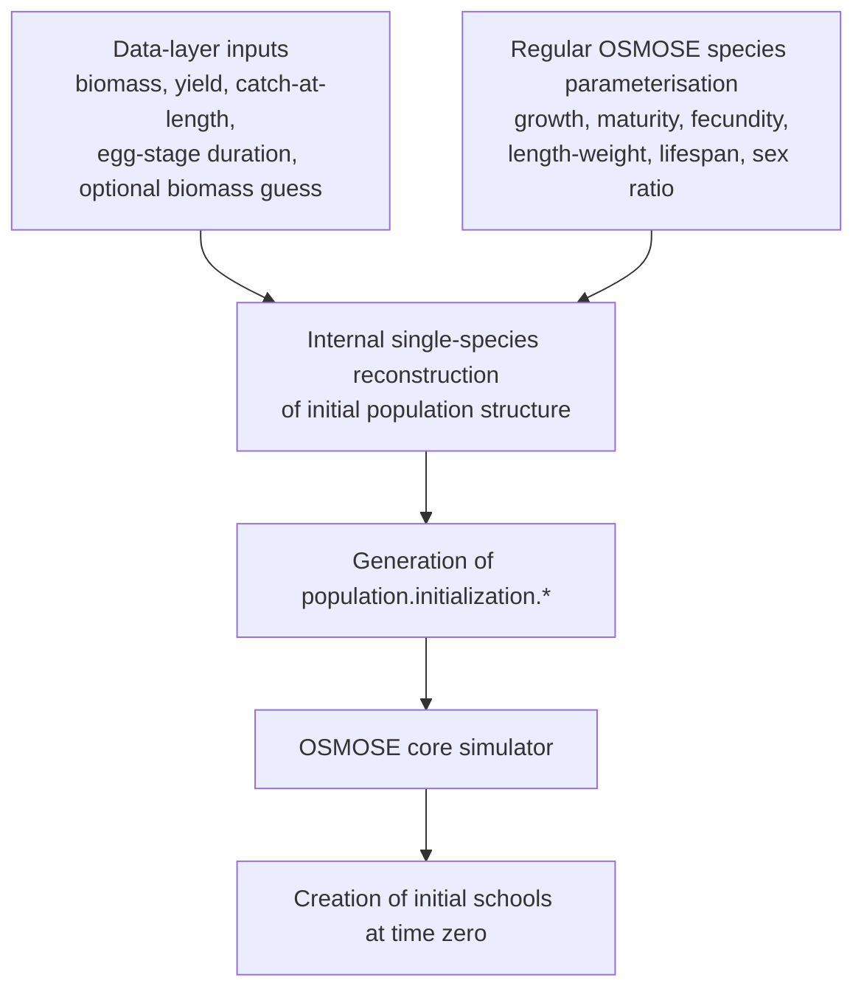

# 1. Introduction

Initialisation is a fundamental part of any OSMOSE simulation. Before the model can simulate growth, mortality, reproduction, movement, predation, and fishing, it must be provided with a starting ecological state. In a school-based, stochastic, multispecies model such as OSMOSE, that starting state is not a trivial quantity. It is not enough to specify only a total biomass by species. The model requires a representation of how populations are distributed across demographic structure and, depending on the method, across schools and space as well.

The purpose of this document is to provide a technical description of the initialisation module in OSMOSE 4.4 and, at the same time, practical documentation for users who need to configure it. The initialisation module has evolved over time, and the current implementation combines methods developed at different stages of the model history. Some are legacy routes retained for backward compatibility or for specific use cases. Others, especially reconstructed population-level initialisation, now provide a more practical and coherent default workflow for most applications.

This document therefore has four main objectives.

First, it explains the conceptual role of initial conditions in OSMOSE and why they matter for the behaviour of the model.

Second, it describes the initialisation methods currently implemented in OSMOSE 4.4, including their conceptual logic, their main differences, and their practical role in the modelling workflow.

Third, it documents the parameters used by these methods, distinguishing carefully between the different layers of configuration involved in the current implementation.

Fourth, it provides practical guidance to users on how to choose an initialisation route, how to set the relevant parameters correctly, and what checks should be performed before accepting an initial state for simulation.

A central theme of the document is the distinction between different representations of the initial state. OSMOSE 4.4 supports direct school-level initialisation, in which the starting schools are provided explicitly through a restart-like file; reconstructed population-level initialisation, in which a class-based population state is reconstructed and then translated into schools by the OSMOSE core simulator; and egg seeding initialisation, in which early population establishment can emerge indirectly through seeded reproduction. These are not merely different file formats. They correspond to different practical and conceptual ways of specifying the starting state of the model.

Among these routes, reconstructed population-level initialisation is the most suitable default workflow for many ordinary applications in OSMOSE 4.4. It uses standard species parameterisation together with biomass and fishery information to generate a coherent population-level starting state, without requiring the user to build a full school-level initial-condition file. For this reason, the document gives particular attention to this method while still documenting the other implemented routes in full.

At the same time, the purpose of this document is descriptive rather than prescriptive in a narrow sense. It aims to document the OSMOSE 4.4 implementation as it currently exists. This is especially important because the initialisation module has accumulated extensions over time, particularly to broaden the applicability of reconstructed population-level initialisation to more data-poor situations. Some aspects of the present configuration structure are therefore historical and may not reflect the cleanest possible design.

For that reason, this document should also be read as documentation of the current state of the codebase prior to future redesign. A more systematic recoding of the initialisation module is planned for a later release, but the need to document the current implementation remains essential. Users of OSMOSE 4.4 require a clear account of what the available methods are, how they operate, and how their parameters should be interpreted in practice.

The remainder of the document is organised as follows. Section 2 introduces the conceptual background of initialisation in OSMOSE. Section 3 provides an overview of the methods currently implemented. Section 4 describes reconstructed population-level initialisation in detail, from its data layer and internal reconstruction procedure to the generation of the `population.initialization.*` block and its use by the OSMOSE core simulator. Section 5 documents the other implemented methods, namely egg seeding initialisation, direct school-level initialisation, and restart-derived generation of population-level initialisation inputs. Section 6 provides user guidance and parameter documentation. Section 7 discusses limitations of the OSMOSE 4.4 implementation and the rationale for future recoding. 

# 2. Conceptual background

## 2.1. Initial conditions in ecosystem and population models

## 2.2. Initialisation in a stochastic, school-based model

## 2.3. Initial conditions versus spin-up

## 2.4. Equilibrium, transient dynamics, and dependence on starting state

## 2.5. What must be initialised in OSMOSE

- total biomass
- population structure across size and age
- trophic level
- number of schools
- spatial distribution

## 2.6. Why practical initialisation methods are needed in OSMOSE

## 2.7. From conceptual initial state to implemented input structures


# 3. Overview of initialisation methods in OSMOSE 4.4

## 3.1. General architecture of the initialisation module

OSMOSE 4.4 includes several routes to define the initial state of focal species at the beginning of a simulation. These routes differ in the way the initial population is described, in the amount of information they require from the user, and in the degree to which the initial state is provided directly or reconstructed from other inputs.

At the broadest level, the initialisation module supports two main types of workflow. In one case, the initial state is provided directly as a school-by-school description. In the other, the initial state is reconstructed first at population level and only later translated into schools. In addition, OSMOSE retains an older seeding-based route in which the model is allowed to generate the initial population dynamically over an initial period.

These methods coexist in OSMOSE 4.4 because they reflect different historical stages in the development of the model and different practical needs. Some methods are more explicit and direct, while others are more practical when the user has standard biological parameterisation and a limited set of observational inputs but no full restart-like initial state.

For clarity, this document distinguishes between the following conceptual methods:

- **Reconstructed population-level initialisation**
- **Direct school-level initialisation**
- **Egg seeding initialisation**

In addition, the current codebase includes a conversion route that derives a population-level initialisation block from restart outputs. This route is best understood as a bridge between school-level and population-level workflows rather than as a fully separate conceptual method.

## 3.2. Distinction between direct initialisation inputs and auxiliary generation procedures

A useful way to understand the initialisation module is to distinguish between the information ultimately consumed by the OSMOSE core simulator (Java) and the procedures used to generate that information.

The OSMOSE core simulator engine requires an explicit initial state from which it can create the schools present at the beginning of the simulation. Depending on the method, this direct initial state takes one of two forms. Either it is supplied as a school-level file, in which each school is already described explicitly, or it is supplied as a population-level parameter block, in which biomass and population structure are specified at class level and schools are created from those aggregate descriptors.

Around these direct initialisation inputs, OSMOSE 4.4 includes auxiliary procedures whose role is to construct the final inputs used at runtime. These procedures do not themselves constitute the initial state. Rather, they are preparation steps. The clearest example is reconstructed population-level initialisation, in which the user provides observational inputs and regular species parameters, and an auxiliary estimation procedure converts that information into the `population.initialization.*` parameters later used by the OSMOSE core simulator.

This distinction is important because many configuration parameters that appear in the initialisation workflow are not read directly by the core simulator when the starting schools are created. Some belong only to the preparatory stage. In practice, confusion often arises when users conflate the data used to reconstruct an initial condition with the initial condition itself. The present document therefore treats the generation procedure and the final initialisation inputs as separate elements of the workflow.

## 3.3. Summary of the implemented methods

### 3.3.1. Reconstructed population-level initialisation

In the reconstructed population-level initialisation, the user does not provide the initial schools directly. Instead, the user provides a set of observational inputs and species parameters from which OSMOSE reconstructs a plausible initial population structure for each focal species. This reconstruction is performed at population level, typically through classes defined over age and size, and is then converted into the `population.initialization.*` parameters. These parameters describe total biomass, biomass allocation among classes, class boundaries, ages, trophic levels, and the number of schools per class. The core simulator then uses this parameter block to create the actual schools at the start of the simulation.

This method is the most suitable default workflow in OSMOSE 4.4 for many practical applications, because it avoids the need for a hand-built restart-like file while remaining more explicit and controllable than seeding.

### 3.3.2. Direct school-level initialisation

In direct school-level initialisation, the user provides an explicit school-by-school description of the initial state through a restart-like netCDF file referenced by `population.initialization.file`. This file contains one record per school and includes, at minimum, the species identity, spatial position, abundance, age, length, weight, and trophic level of each school.

Conceptually, this is the most direct form of initialisation, because the initial schools are already fully specified. It is particularly suitable for restart workflows, coupling applications, or cases in which the user already has a detailed school-level state available from a previous simulation or from an externally generated file.

### 3.3.3. Egg seeding initialisation

Egg seeding initialisation is an older route in which the model begins with ghost spawners whose biomass is specified by species and which release eggs during a preliminary seeding phase. The objective is not to define the final initial state explicitly, but rather to allow OSMOSE to generate a population dynamically over an initial period. The duration of the seeding phase and the seeding biomass by species are provided by configuration parameters.

This method can still be useful in particular situations, but it is not the preferred general workflow for OSMOSE 4.4 because the resulting initial state is obtained only indirectly and may require a longer stabilisation period. Notably, this method is incompatible with an interannual simulation.

### 3.3.4. Restart-derived generation of population-level inputs

The codebase also contains procedures that read restart outputs and convert them into a `population.initialization.*` block. These procedures occupy an intermediate position between direct school-level and reconstructed population-level initialisation. They do not reconstruct the initial state from observational data in the same way as the population-level method, but they do aggregate an explicit school-level state into the parameterised format used by population-level initialisation.

This route is useful when a user wishes to derive a compact population-level initialisation block from an equilibrated or otherwise prepared restart state, for example to simplify subsequent configurations or to transfer an initial state between workflows.

## 3.4. Comparative overview of the methods

The three main initialisation families differ in what they require from the user, what they produce, and what type of question they are best suited to answer.

The reconstructed population-level initialisation requires a standard species parameterisation together with initialisation-relevant observational inputs, such as biomass, yield, and, when available, catch-at-length. It produces a population-level initialisation block, which is then expanded into schools by the core simulation engine. Its main advantage is practical usability: it allows a coherent initial state to be generated without requiring an explicit school file. Its main limitation is that the reconstruction is approximate and depends on the quality and consistency of the supplied biological and observational inputs.

Direct school-level initialisation requires a restart-like netCDF file describing the initial schools explicitly. It produces no intermediate reconstruction, because the file itself is already the direct initial state. Its main advantage is precision and transparency at school level. Its main limitation is that preparing such a file can be technically demanding, especially outside restart or coupling contexts.

Egg seeding initialisation requires only the configuration of a seeding duration and seeding biomasses by species. It does not define the full initial state explicitly, but instead lets the model generate it over time. Its main advantage is conceptual simplicity in some special cases. Its main limitation is that the starting state is highly indirect and may require longer stabilisation before the model reaches a satisfactory demographic structure, but this is not guaranteed.

The restart-derived conversion route is best regarded as a utility workflow. It uses an already available school-level state as its starting point and produces a population-level parameter block that can later be reused. It is therefore especially useful for moving between initialisation representations.

## 3.5. Why reconstructed population-level initialisation is the preferred default

For OSMOSE 4.4, reconstructed population-level initialisation should generally be regarded as the preferred default method. This preference is based less on theoretical elegance than on practical balance.

Compared with direct school-level initialisation, the population-level route is easier to set up in ordinary modelling workflows because it does not require the user to prepare a complete school-by-school initial state file. At the same time, compared with egg seeding, it offers a much more explicit and controllable representation of the starting population. The user can inspect the generated `population.initialization.*` block, verify the reconstructed biomass and demographic structure, and diagnose inconsistencies before running the simulation.

This method also integrates naturally with the regular OSMOSE parameterisation. Most of the biological parameters it uses are already part of the standard model configuration, which reduces duplication and improves internal consistency. Although the current implementation includes patches added to extend the method to more data-poor situations, its overall logic remains well aligned with ordinary OSMOSE parameterisation practice.

For these reasons, reconstructed population-level initialisation provides the most useful compromise between realism, flexibility, and practical usability in the current version of the model.

## 3.6. Common source of confusion: population-level versus school-level initialisation

A recurring difficulty in the use of the OSMOSE initialisation module is the tendency to mix up the representation level of the initial state.

In school-level initialisation, the initial condition is the explicit list of schools. Each school already exists in the input file with its own species, position, abundance, age, length, weight, and trophic level. The file therefore defines the initial state directly.

In population-level initialisation, the initial condition is not a created from a list of schools but a species-level description of the population distributed across classes. The `population.initialization.*` parameters do not identify individual schools in advance. Instead, they describe how much biomass should be placed in each class, what age and trophic level should be associated with that class, and how many schools should be created to represent it. The actual schools that represent the initial state are then generated from this aggregated description by the OSMOSE core simulator.

This distinction is important in its own right, but in OSMOSE 4.4 it is further complicated by the existence of preparatory procedures that generate the population-level block from data or from restart outputs. As a result, users often encounter three different objects in a single workflow:

- observational and biological inputs used to reconstruct a population-level initial state;
- the generated `population.initialization.*` block;
- the schools ultimately created by the simulator.

These are three different representations of the initial state at different stages of the workflow, but the latter are formally the *initial conditions* of the model. The rest of this document is structured precisely to keep them separate: Section 4 focuses on reconstructed population-level initialisation, Section 5 on the other implemented methods, and Section 6 on the user-facing configuration and parameter documentation.


# 4. Reconstructed population-level initialisation initialisation

## 4.1. Purpose and general principle

The *reconstructed population-level initialisation* initialisation method was developed to provide a practical way to initialise OSMOSE without requiring the user to prepare an explicit school-by-school restart file. Instead of specifying the full state of every school directly, the user provides a set of observational inputs and biological parameters from which OSMOSE reconstructs a plausible initial population structure for each focal species. This reconstructed structure is then translated into the `population.initialization.*` parameters, which are the actual inputs consumed by the simulation engine at runtime.

Conceptually, the method separates the problem of initialisation into two stages. In the first stage, a single-species approximation is fitted to the information available for each focal species, using biomass, catch, catch-at-length, growth, reproduction, and mortality-related inputs. In the second stage, the fitted population structure is converted into an aggregated initial-condition description at species level, including total biomass, biomass distribution among classes, class boundaries, ages, trophic levels, and the number of schools used to represent each class. OSMOSE then uses these parameters to instantiate individual schools at the beginning of the simulation.

This approach was originally developed in a data-rich context, in which biomass, yield, and catch-at-length information were generally available for all focal species. Over time, the implementation was extended to cope with more data-poor situations, for example when only an approximate biomass guess is available or when catch-at-length information is missing. As a result, the current OSMOSE 4.4 implementation combines a clear central idea with a number of practical extensions introduced to increase flexibility. It is therefore important to document both the conceptual structure of the method and the exact behaviour of the current implementation.

At a high level, the workflow can be summarised as follows:

**data-layer inputs and regular biological parameterisation** $\rightarrow$ **single-species reconstruction of the initial population** $\rightarrow$ **generation of `population.initialization.*` parameters** $\rightarrow$ **creation of schools by the Java initialisation code**

## 4.2. Two-layer structure of the method

A central feature of this method is that it operates through two distinct configuration layers. This distinction is conceptually simple, but in practice it has often been a source of confusion for users, because both layers are expressed through OSMOSE parameters.

### 4.2.1. The data layer

The first layer is the *data layer*. It contains the observational inputs and auxiliary parameters used to reconstruct an initial population structure for each focal species. In practice, this includes quantities such as observed biomass, yield, catch-at-length, an optional biomass guess, and a small number of specific additional inputs such as egg-stage duration and biomass cutoff size. These data-layer parameters do not define the initial schools directly. Rather, they provide the information needed for the estimation procedure that generates the actual initialisation block.

### 4.2.2. The initialisation layer

The second layer is the *initialisation layer*. This is the actual parameter block used by OSMOSE to create the starting state of the simulation. It consists of the `population.initialization.*` parameters, which describe, for each focal species, the total initial biomass, the relative biomass allocated among classes, the class boundaries in size, the representative ages, the assigned trophic levels, and the number of schools to be created in each class.

### 4.2.3. Why the distinction matters

The distinction matters because the data-layer configuration is not itself the initial condition. It is only an auxiliary specification used to estimate or reconstruct the initial condition. In other words, the user may provide biomass files, catch-at-length files, yield series, selectivity assumptions, and related parameters, but these are not read directly by the core OSMOSE simulator (Java) when the schools are created. What the simulator reads are the `population.initialization.*` parameters generated from that information.

This separation is especially important when documenting workflows and debugging configurations. If a user is working with the population-level initialisation, there are therefore two separate questions to answer:

1. Is the data layer properly configured so that OSMOSE can reconstruct a plausible initial population?
2. Once reconstructed, are the generated `population.initialization.*` parameters consistent and meaningful?

Any technical description of this method must keep these two questions distinct.

## 4.3. Activation and position within the initialisation module

The population-level initialisation method is activated through the flag

```text
population.initialization.relativebiomass.enabled = TRUE
```

When this flag is enabled, OSMOSE uses the *population-level* initialisation route rather than relying on the legacy seeding method or on a direct *school-level* initialisation. In this workflow, the purpose of the preliminary R code is to construct a parameterised initial state, while the Java code uses that parameter block to instantiate the actual schools.

Within the broader initialisation module, this method occupies an intermediate position between the two extremes. On one side, the *school-level* initialisation route is highly explicit, because the complete school-level state is provided directly by the user, normally from a netCDF *restart* file. On the other side, the *seeding* initialisation route is highly indirect, because the model is allowed to generate the initial population dynamically during a preliminary period. The reconstructed population-level method occupies a more practical middle ground: it reconstructs a detailed initial population structure from species-level information, but expresses the result in a compact parameterised form.

For OSMOSE 4.4, this is the most suitable default workflow for most practical applications. It avoids the need for a hand-built restart file, while remaining more explicit and controllable than the seeding-based route. At the same time, it should be recognised that the current implementation reflects the historical evolution of the module and includes additional patches introduced after the original data-rich design.

## 4.4. Inputs required in the data layer

The data layer is designed to provide the information needed to reconstruct the initial state of each focal species. Some of these inputs are specific to the initialisation procedure itself, while many others are borrowed from the regular OSMOSE parameterisation. In particular, most biological parameters used by the method—such as growth, length–weight, maturity, fecundity, lifespan, and sex ratio—are not unique to the initialisation module. They are generally already defined as part of the standard species parameterisation and therefore do not need to be specified again specifically for initialisation. The data layer mainly adds the observational inputs and a small number of additional settings needed to interpret them.

### 4.4.1. Biomass information

The method can use observed biomass information through parameters such as:

```text
observed.biomass.file.spX
observed.biomass.ndtPerYear.spX
observed.biomass.cutoff.size.spX
```

The biomass file provides a time series of biomass estimates for the species. The associated `ndtPerYear` parameter specifies the temporal resolution of that file. The parameter `observed.biomass.cutoff.size.spX` is used to mimic the observation process by excluding the biomass of schools below a specified size threshold when comparing the reconstructed population to the observed biomass index.

When no suitable biomass time series is available, or when a simpler configuration is needed, the method can also use an approximate biomass value supplied through:

```text
observed.biomass.guess.spX
```

In the current implementation, this biomass guess takes precedence over the biomass file when both are present. This behaviour reflects the practical extensions that were added to the original data-rich method in order to support more data-poor contexts.

### 4.4.2. Fishery information

The initialisation method also uses fishery information, especially to reconstruct fishing mortality and selectivity. The two principal inputs are yield and catch-at-length.

Yield is provided through:

```text
fisheries.yield.file.spX
fisheries.yield.ndtPerYear.spX
```

This file is treated as the landings or yield series for the species. In the intended workflow, it is supplied even for non-exploited species, in which case the corresponding series should contain zeros rather than missing values.

Catch-at-length, when available, is supplied through:

```text
fisheries.catchatlength.file.spX
fisheries.catchatlength.ndtPerYear.spX
```

This information is especially valuable because it allows the method to infer an empirical size selectivity pattern, rather than relying only on an assumed selectivity function. In the original data-rich applications of the method, catch-at-length was generally available and played an important role in reconstructing the initial demographic structure.

### 4.4.3. Biological parameters used indirectly

In addition to the observational data just described, the method depends on a broad set of biological parameters. Most of them belong to the regular OSMOSE species parameterisation and are therefore typically already available in a properly configured model. The user normally does not need to duplicate these values in a separate initialisation file. The initialisation procedure simply reuses them.

These reused parameters include, among others:

- growth parameters such as `species.k`, `species.linf`, `species.t0`, `species.vonbertalanffy.threshold.age`, and `species.egg.size`;
- length–weight parameters such as `species.length2weight.condition.factor` and `species.length2weight.allometric.power`;
- maturity parameters such as `species.maturity.size`, `species.maturity.l50`, or `species.maturity.age`;
- fecundity and reproductive timing information used through the regular reproduction configuration;
- lifespan and sex ratio, used in the internal mortality calculation.

The main biological parameter that is more directly tied to the initialisation workflow itself is:

```text
species.egg.stage.duration.spX
```

This parameter is used in the mortality calculation associated with the reconstruction procedure. In practice, it is usually specified in the data-layer configuration because it has a direct role in estimating the early-life mortality schedule used during initialisation.

### 4.4.4. Selectivity parameters

When catch-at-length is unavailable, the method needs a parametric description of selectivity. In that case, the data layer must provide selectivity settings through parameters such as:

```text
fisheries.selectivity.type.spX
fisheries.selectivity.l50.spX
fisheries.selectivity.l75.spX
```

and, depending on the selectivity type, potentially additional parameters such as `l25`, `l0`, `l1`, `plateau`, `breaks`, or `values`, as used in OSMOSE fisheries configuration.

The selectivity type controls the functional form used to represent the fishing pattern by size. Supported forms in the current implementation include knife-edge, logistic, normal, log-normal, several double-normal variants, and a non-parametric option. When empirical catch-at-length information is available, selectivity can instead be inferred from those data, which is generally preferable.

### 4.4.5. Data-rich versus data-poor use

The original design of this method assumed a data-rich context in which biomass, yield, and catch-at-length were normally available for each focal species. Later applications revealed that this assumption was too restrictive, and the module was progressively extended to allow reduced-input configurations. For example, a species may be initialised using a biomass guess rather than a full biomass time series, or using an assumed selectivity curve when catch-at-length is unavailable.

These extensions greatly improve the practical usability of the method, but they also mean that the current OSMOSE 4.4 implementation includes several branches that correspond to different data situations. The population-level workflow should therefore be understood as a family of closely related procedures built around a common core rather than as a single algorithm.

## 4.5. Internal reconstruction of the initial population

Once the data layer has been specified, the method reconstructs an initial population structure for each focal species using a single-species approximation. This reconstruction is not meant to reproduce the full multispecies OSMOSE dynamics during initialisation. Rather, it is intended to produce a plausible demographic and biomass structure that can serve as a coherent starting point for the full simulation.

### 4.5.1. Population discretisation

The internal reconstruction is performed over a discretised age structure defined according to the temporal resolution of the simulation. Ages are represented from the beginning of life to the model lifespan, using age bins based on the model time step. The corresponding sizes are then obtained from the configured growth curve. This results in a species-specific discretisation of the initial population over age and size classes.

The reconstructed quantities are therefore not school-level quantities. At this stage, the population is represented as a structured distribution over age and size, from which the final aggregated initialisation parameters will later be generated.

### 4.5.2. Growth model

The method uses the internal growth function `VB()` to derive length-at-age. In the initialisation module, the growth calculation relies on the cubic early-life formulation used in the code, which connects smoothly to the von Bertalanffy growth curve at older ages. This choice avoids unrealistic behaviour near age zero and provides a continuous way to derive the size structure required by the initialisation procedure.

### 4.5.3. Weight-at-length relationship

Length is converted to weight using the species-specific length–weight relationship already defined in the regular OSMOSE parameterisation. This conversion is required both to derive biomass from abundance and to relate the reconstructed population structure to the observed biomass and yield data supplied in the data layer.

### 4.5.4. Recruitment and fecundity structure

The method uses the configured fecundity and reproductive timing information to determine the within-year distribution of recruitment. In practice, relative fecundity over the annual cycle is used to define the seasonal pattern of recruitment entering the reconstructed population. This preserves consistency between the initialisation procedure and the life-history assumptions adopted in the OSMOSE simulation itself.

### 4.5.5. Natural mortality

A distinctive feature of the method is that natural mortality is not simply taken as a fixed constant by species. Instead, the initialisation module computes an internal mortality schedule based on life-history information (Caddy 1997). Conceptually, this calculation uses mean lifetime fecundity, lifespan, sex ratio, and egg-stage duration to derive a decreasing mortality schedule over life. That schedule is then mapped onto the age discretisation used in the reconstruction.

This approach is meant to produce a plausible demographic decline with age while remaining consistent with the reproductive capacity of the species. In practical terms, it is one of the key mechanisms linking the biological parameterisation of the species to the shape of the reconstructed initial population.

### 4.5.6. Fishing mortality and selectivity

Fishing mortality is incorporated into the reconstruction using the available yield information together with either empirical or assumed selectivity.

When catch-at-length is available, the method rebins the observed catch-at-length data to the internal size discretisation and uses the resulting pattern to infer how fishing is distributed across sizes. This allows the reconstruction to reflect the observed size composition of catches.

When catch-at-length is unavailable, the method falls back on the selectivity function specified by the user. In that case, the shape of the fishing pattern is determined by the assumed selectivity curve rather than by empirical size composition data.

### 4.5.7. Biomass fitting target

Observed biomass is not compared to the entire reconstructed population indiscriminately. Instead, the method excludes classes below the configured biomass cutoff size when computing the biomass target to be matched. This reflects the fact that observed biomass indices often represent only the portion of the population effectively sampled by the observation process, for example because of survey selectivity or minimum detectable size.

As a result, the reconstructed total population biomass may be larger than the biomass directly comparable to the observed index.

### 4.5.8. Yield fitting target

Yield information is used jointly with biomass information to constrain the reconstruction. In effect, the method seeks an internally coherent combination of recruitment, fishing intensity, and population structure such that the reconstructed biomass and yield are compatible with the supplied observations or guesses. This joint use of biomass and yield is one of the key reasons why the method can provide a more informative initialisation than an approach based on biomass alone.

### 4.5.9. Species absent from the initial state

The implementation also allows for the case in which a species should effectively start absent from the simulation. If the biomass guess is zero, the method returns a degenerate initial state with zero biomass, zero catch, and zero recruitment, rather than forcing a non-zero starting population. This behaviour is useful for configurations in which a species is declared as focal but is not present initially.

## 4.6. Estimation procedure and reconstructed outputs

The reconstruction procedure can be understood as a fitting problem in which a simplified age-structured population model is adjusted so that its biomass and yield are compatible with the information supplied in the data layer.

### 4.6.1. Initial approximation

When catch-at-length is available, the procedure first builds an initial approximation of the population structure by simulating survival and catch over the discretised age classes using the observed catch-at-length pattern. This provides a first estimate of the initial size and age structure, seasonal fishing pattern, recruitment level, and selectivity.

When such information is unavailable, the method instead relies more heavily on the biomass guess and on the configured selectivity assumptions to construct an initial approximation.

### 4.6.2. Joint fitting of recruitment and fishing level

The main free quantities adjusted by the method are, in essence, the recruitment level and the overall fishing intensity. These are fitted so that the reconstructed biomass and yield are jointly compatible with the supplied targets. The implementation uses optimisation to adjust these quantities and to reconcile the two data streams as well as possible under the model assumptions.

In practice, this means that the method is not simply extrapolating a biomass structure from growth and mortality alone. It is estimating a population state consistent with both the abundance of fish in the system and the removals implied by fishing.

### 4.6.3. Reconstructed internal outputs

Before translation into `population.initialization.*`, the procedure reconstructs several internal outputs for each focal species, including:

- the population abundance distribution over age/size classes;
- the biomass distribution over classes;
- the expected yield distribution over the annual cycle;
- the inferred selectivity pattern;
- the seasonal fishing pattern;
- an estimate of annual recruitment.

These outputs are internal to the reconstruction step, but they are essential because they determine the parameter block ultimately passed to the Java initialisation code.

### 4.6.4. Estimation of larval mortality

Larval mortality is inferred by comparing the egg production implied by the reconstructed adult population and fecundity schedule to the recruitment level required by the reconstructed initial population. This provides an internally consistent estimate of early-life mortality under the assumptions of the method.

The implementation includes checks intended to identify clearly implausible results, for example when the estimated larval mortality is too low relative to what would be expected from the fecundity settings. Such cases should be treated as a warning that the underlying biological parameterisation may require revision.

## 4.7. Translation to `population.initialization.*`

Once the internal reconstruction has been completed, its results are translated into the `population.initialization.*` block used by OSMOSE at runtime. This step is crucial because it defines the exact meaning of the parameters that the Java code will later consume.

### 4.7.1. `population.initialization.biomass.spX`

This parameter gives the total initial biomass of species `spX`, expressed in tonnes. It defines the total amount of biomass to be allocated among the initial classes for that species in all the model domain.

### 4.7.2. `population.initialization.relativebiomass.spX`

This parameter gives the relative biomass distribution among the initial size-classes. The values should sum to one, up to numerical rounding. Together with the total biomass parameter, it determines how much biomass is placed in each size-class at initialisation.

### 4.7.3. `population.initialization.size.spX`

This parameter requires special attention. It is not a vector of representative class sizes. It is a vector of class boundaries. A vector of length $N + 1$ defines $N$ initial size classes through consecutive lower and upper bounds.

For example, if the vector contains values $L_0, L_1, \dots, L_N$, then class 1 is defined by $[L_0, L_1]$, class 2 by $[L_1, L_2]$, and so on. This is important because the Java code later draws school lengths uniformly within each class interval.

### 4.7.4. `population.initialization.age.spX`

This parameter gives the representative age associated with each class, expressed in years. Its length must match the number of classes defined by the size intervals.

### 4.7.5. `population.initialization.tl.spX`

This parameter gives the initial trophic level assigned to each class. In the current population-level implementation, the generated values are simple class-level trophic-level assignments rather than the result of a full food-web calculation during initialisation. The main purpose of this vector is to provide the simulator with an initial trophic-level state consistent with the chosen parameterisation.

### 4.7.6. `population.initialization.nschool.spX`

This parameter gives the number of schools that will be created in each class. It is therefore the bridge between the class-level biomass description and the school-based representation actually used by OSMOSE.

### 4.7.7. Additional larval mortality-related parameter

In addition to the core initialisation block, the current implementation also generates a larval mortality estimate. If a larval mortality parameter is not defined in the configuration (usually before calibration), then the initialisation will create it as

```text
mortality.additional.larva.rate.spX
```

or as

```text
initialization.additional.larva.rate.spX
```
if the parameter already exists, to avoid duplication. 

In practice, users should be aware that the generated initialisation block may therefore include a larval mortality-related parameter whose name depends on the current configuration state.

### 4.7.8. Internal allocation rule for school numbers

The number of schools per class is not assigned arbitrarily. In the current implementation, it is derived from the reconstructed biomass distribution in such a way that classes containing more biomass receive more schools, subject to lower and upper bounds linked to the species-level total number of schools. This preserves a loose correspondence between demographic importance and school representation while ensuring that even classes with low biomass can still be represented.

## 4.8. How Java instantiates the schools from these parameters

After the `population.initialization.*` block has been generated, the Java initialisation code uses it to create the actual schools that define the starting state of the simulation, following these steps:

1. **Reading and checking the parameter vectors:** The Java code first reads the parameter vectors for total biomass, relative biomass, size boundaries, trophic levels, ages, and school numbers. It checks that the lengths of the class-level vectors are consistent. In particular, the number of values supplied for trophic level, relative biomass, age, and number of schools must match the number of classes implied by the size-boundary vector.

2. **Interpreting the size vector**: The size vector is interpreted as a set of class limits. The code builds one class from each adjacent pair of values. This confirms that `population.initialization.size.spX` must be documented as class boundaries rather than class centres.

3. **Converting age to model time steps:** Ages are read in years from `population.initialization.age.spX`, then converted internally to the model’s discrete time-step units. This ensures consistency with the school age representation used elsewhere in OSMOSE.

4. **Splitting biomass among classes and schools:** For each species, the total initial biomass is multiplied by the class-specific relative biomass proportion. The resulting class biomass is then divided among the number of schools specified for that class. Each school created within the class therefore receives an equal share of the class biomass.

5. **Random draw of school length within class limits:** Within each class, the length of each school is drawn at random between the lower and upper boundaries of the class. The only special case is the egg stage: when the age is zero in time-step units, the school length is forced to the species egg size rather than randomly drawn. This means that the population-level method does not generate all schools in a class with identical lengths. Instead, it produces a simple within-class variability by random allocation within the class interval.

6. **Conversion to weight and abundance:** Once school length has been drawn, individual weight is computed from the species length–weight relationship, except for eggs, for which egg weight is used. School abundance is then derived from the biomass allocated to the school divided by individual weight. Since biomass is expressed in tonnes and weight in grams, the code performs the corresponding unit conversion internally.

7. **Creation of school objects:** The resulting species identity, abundance, length, weight, and age are used to create the actual `School` objects that populate the simulation at time zero. At this stage, the abstract initial-condition block has been fully converted into the school-based representation required by OSMOSE.

If the corresponding model options are enabled, the initialisation code also handles genotype instantiation and bioenergetics-related maturation information. These are not specific to the population-level method itself, but they affect the attributes assigned to newly created schools and should therefore be recognised as part of the runtime behaviour of the initialisation process.

## 4.9. Interpretation, assumptions, and limitations

The reconstructed population-level method should be understood as a pragmatic reconstruction procedure rather than as an exact historical reconstitution of the school-level state of the ecosystem.

The method aims to reconstruct a plausible initial biomass and demographic structure for each focal species. It does not attempt to recover the exact identity, location, size, and trophic state of every school that might have existed in the real system at the start of the simulation.

A central limitation is that the reconstruction is performed species by species. Multispecies interactions are not solved explicitly during the estimation stage. They only come into play once the full OSMOSE simulation starts from the generated initial state. This is an important simplification, but it is also one of the reasons why the method remains practical.

Compared with a full restart-based initialisation, trophic level and space are treated more simply. In the population-level workflow, trophic level is assigned at class level and space is not reconstructed through an explicit school-level state file. The method is therefore primarily designed to reconstruct biomass and demographic structure rather than the full initial spatial arrangement of schools.

The quality of the reconstructed initial state depends strongly on the consistency and plausibility of the biological parameters used by the method. Growth, maturity, fecundity, lifespan, sex ratio, and length–weight settings all influence the inferred mortality schedule and the resulting demographic structure. Implausible or inconsistent species parameterisation can therefore propagate directly into the initial condition. This warning also apply to the quality and consistency of the data used to reconstruct the population, as implausible or inconsistent data will propagate directly into the initial condition.

Finally, the current OSMOSE 4.4 implementation reflects the historical accumulation of practical patches introduced to broaden the applicability of the method. This does not invalidate the approach, but it does mean that some aspects of the configuration structure are less transparent than they could be in a more systematically redesigned module. For this reason, the method should be carefully documented as currently implemented, while recognising that a future recoding is likely to simplify its structure.

## 4.10. Practical guidance for users

From a user perspective, the reconstructed population-level method is most effective when approached as a reconstruction workflow with a clearly defined purpose: to generate a coherent `population.initialization.*` block from the best available information for each focal species.

### 4.10.1. Recommended minimum setup in data-rich situations

In a data-rich application, the recommended setup is to provide, for each focal species:

- an observed biomass series and its temporal resolution;
- a biomass cutoff size;
- a yield series and its temporal resolution;
- a catch-at-length file and its temporal resolution;
- the regular species biological parameterisation needed by OSMOSE, including growth, length–weight, maturity, fecundity, lifespan, and sex ratio;
- egg-stage duration.

This is the configuration for which the method was originally designed and generally provides the strongest basis for reconstructing the initial state.

### 4.10.2. Reduced setups for data-poor situations

When data are poorer, the method can still be used with reduced input. For example:

- a biomass guess may be used instead of a full biomass series;
- a parametric selectivity function may be used instead of catch-at-length;
- non-exploited species may still be supplied with a yield series containing zeros.

These reduced configurations are useful, but they also imply that a larger part of the reconstruction depends on assumed rather than directly observed information.

### 4.10.3. Parameters users should verify carefully

Before running the initialisation, users should verify in particular:

- that the temporal resolutions of biomass, yield, and catch-at-length files are correctly specified;
- that the biomass cutoff size is consistent with the observation process represented by the biomass index;
- that growth and maturity parameters are biologically compatible;
- that the selectivity assumptions are plausible when catch-at-length is unavailable;
- that `population.initialization.size.spX` is understood as a vector of class boundaries;
- that the generated vectors in the `population.initialization.*` block have consistent lengths.

### 4.10.4. Suggested outputs to inspect after generation

After generating the initialisation block, it is advisable to inspect:

- the reconstructed biomass and yield against the supplied targets;
- the resulting size and age structure for biological plausibility;
- the estimated larval mortality values;
- the generated `population.initialization.*` parameters themselves, especially the biomass distribution, size boundaries, ages, and number of schools.

These checks are particularly important in reduced-data configurations, where the reconstruction necessarily relies more heavily on assumptions.

In summary, the reconstructed population-level initialisation method provides a practical and conceptually coherent way to initialise OSMOSE from species-level information. Its main strength is that it bridges the gap between full school-level restart files and highly indirect seeding-based approaches. 


# 5. Other implemented initialisation methods

This section documents the other initialisation routes currently implemented in OSMOSE 4.4. Although reconstructed population-level initialisation is the preferred default workflow for most practical applications, the model still supports other methods that remain useful in particular contexts. These methods reflect earlier stages in the development of OSMOSE and continue to serve specific technical purposes.

The three routes covered here are egg seeding initialisation, direct school-level initialisation, and restart-derived generation of population-level initialisation inputs. The first is an indirect, reproduction-based route in which the initial population emerges dynamically from seeded reproduction. The second is the most explicit route, in which the initial schools are provided directly through a restart-like file. The third is a utility workflow that converts an explicit school-level state into the population-level parameter block used by reconstructed population-level initialisation.

## 5.1. Egg seeding initialisation

### 5.1.1. General principle

Egg seeding initialisation is a legacy, reproduction-based route in which the initial population is not specified explicitly, either at school level or at population level. Instead, the mechanism is implemented within the reproduction process of the OSMOSE core simulator (Java), where it can generate eggs artificially from a user-defined seeding quantity when a species produces no eggs from its actual mature schools and the simulation is still within the configured seeding period.

Functionally, this mechanism can serve two related purposes. First, it can act as an indirect initialisation method when the model starts without mature individuals, in which case seeded reproduction generates the first cohorts until a self-sustaining reproducing population becomes established. Second, it can be used more generally as a safeguard against collapse, for example by assigning a very small seeding value that allows a species to recover even after severe depletion. In both cases, the resulting population is not given directly by the user but emerges dynamically from reproduction and subsequent life-history processes.

Egg seeding therefore remains useful as an initialisation route in OSMOSE 4.4, even though it is implemented as part of the reproduction process and can also be used outside strict initialisation in a broader anti-collapse role.

### 5.1.2. Required parameters

The egg seeding route is controlled by a seeding duration and by species-specific seeding quantities.

The first parameter controls the duration of the seeding phase:

```text
population.seeding.year.max
```

This parameter gives the maximum duration of seeding in years. Internally, it is converted to the corresponding number of model time steps.

For each species, the user may then supply a seeding biomass and, where relevant, a seeding abundance:

```text
population.seeding.biomass.sp0
population.seeding.biomass.sp1
...
population.seeding.biomass.spX
```

```text
population.seeding.abundance.sp0
population.seeding.abundance.sp1
...
population.seeding.abundance.spX
```

Which of these two quantities is used depends on the species reproduction mode. In the current implementation, oviparous species use biomass-based seeding, whereas viviparous species use abundance-based seeding. Users should therefore ensure that the seeding quantities are consistent with the reproductive mode specified for each species.

If `population.seeding.year.max` is not provided, and reconstructed population-level initialisation is not enabled, OSMOSE sets the seeding duration by default to the lifespan of the longest-lived species and emits a warning. This behaviour reflects the historical role of seeding as the implicit fallback route in older workflows.

### 5.1.3. How the seeding mechanism operates

At each time step, the reproduction process computes egg production from the mature schools currently present in the system. This computation depends on the spawning season, sex ratio, fecundity, and the quantity of spawners available for the species. If mature schools produce eggs normally, those eggs are used and the seeding mechanism is not activated.

Seeding is triggered only when two conditions are met simultaneously:

1. the total number of eggs produced by mature schools for the species is zero;  
2. the simulation time is still before the end of the configured seeding period.

When this happens, OSMOSE computes an artificial egg production from the configured seeding biomass or seeding abundance, using the same broad reproductive ingredients as ordinary spawning: sex ratio, fecundity, seasonal spawning fraction, and seeding quantity. The mechanism therefore does not create a mature population explicitly. Instead, it introduces an artificial spawning biomass that produces missing natural egg production during the seeding phase.

The eggs produced through seeding are then converted into schools at age class zero, just as in the regular reproduction process. The population that later appears in the simulation therefore emerges from these age-0 schools and their subsequent development, rather than being inserted directly as a complete mature population.

### 5.1.4. Practical interpretation

From a practical perspective, egg seeding can be interpreted in two complementary ways.

When species begin without mature individuals, or when the initial state would otherwise fail to produce eggs, seeding acts as an indirect initialisation mechanism, by creating the first age-0 cohorts until mature individuals appear and ordinary reproduction can take over. This explains why seeding has historically been treated as one of the initialisation methods of OSMOSE, even though its implementation is embedded in the reproduction process rather than in a standalone initial-condition configuration.

When mature populations exist but the user wishes to avoid irreversible collapse, seeding can instead be used as a safeguard. In that case, the seeding quantity may be set to a very low value so that, even if the simulated population crashes to the point where no eggs are produced by mature schools, a minimal reproductive source remains available and recovery becomes possible.

These two uses are closely related, because both rely on the same mechanism: artificial egg production triggered when natural spawning fails.

### 5.1.5. Strengths and limitations

The main strength of egg seeding is that it provides a simple and robust way to maintain a minimal reproductive source in the system. This can be useful both for starting the simulation from the absence of mature individuals and for preventing permanent collapse in cases where a small residual reproductive capacity is intended to remain.

Its main limitation is that it offers only indirect control over the resulting initial state. The user specifies a seeding biomass quantity and a duration, but not the final age structure, size structure, trophic-level distribution, or school composition that will emerge from the process. The resulting population therefore depends on the interaction between seeded reproduction and the subsequent model dynamics.

For this reason, egg seeding is generally less explicit and less transparent than reconstructed population-level initialisation or direct school-level initialisation. It should be regarded as a legacy but still useful route, particularly when a phenomenological recovery mechanism is desirable or when the simulation must establish a reproducing population from an initial absence of mature individuals.

### 5.1.6. Example

A typical biomass-based configuration looks like:

```text
population.seeding.year.max = 50

population.seeding.biomass.sp0 = 6420
population.seeding.biomass.sp1 = 8068
population.seeding.biomass.sp2 = 6916
population.seeding.biomass.sp3 = 9940
population.seeding.biomass.sp4 = 3000
population.seeding.biomass.sp5 = 37868
population.seeding.biomass.sp6 = 3316
population.seeding.biomass.sp7 = 28544
population.seeding.biomass.sp8 = 10720
population.seeding.biomass.sp9 = 186040
```

In this example, seeding is available for fifty years, and each species is assigned a seeding biomass used to generate eggs if the species has no egg production from mature schools during that period. In practice, the same logic applies to abundance-based seeding for viviparous species, except that the configured quantity is then expressed in abundance rather than biomass.

## 5.2. Direct school-level initialisation

### 5.2.1. General principle

Direct school-level initialisation is the most explicit way to initialise OSMOSE. In this route, the user provides the initial state directly as a school-by-school description through a restart-like netCDF file. The OSMOSE core simulator (Java) then reads this file and uses it as the starting state of the simulation.

Conceptually, this route differs fundamentally from reconstructed population-level initialisation. In population-level initialisation, the user provides a class-based aggregate description from which schools are later created. In school-level initialisation, the schools already exist in the input. The file therefore constitutes the initial condition itself rather than an intermediate representation.

### 5.2.2. Required parameter

Direct school-level initialisation is controlled through a single parameter:

```text
population.initialization.file
```

This parameter points to a netCDF file containing the full school-level initial state. For example:

```text
population.initialization.file = input/initial_conditions/humboldt-n_1992.nc
```

The file path is relative to the configuration in the usual OSMOSE way.

### 5.2.3. Expected file structure

The expected file structure is the same general type as an OSMOSE restart file. The file contains one record per school, with dimension `nschool`, and includes at least the following variables:

- `species`: species index of the school;
- `x`, `y`: spatial grid indices of the school;
- `abundance`: number of individuals in the school;
- `age`: age of the school, in years;
- `length`: body length, in centimetres;
- `weight`: body weight, in grams;
- `trophiclevel`: trophic level of the school.

In addition, the file typically contains global attributes such as the simulation step and a mapping between species indices and species names. A representative example is:

```text
dimensions:
  nschool = 20287

variables:
  int species[nschool]
  float x[nschool]
  float y[nschool]
  double abundance[nschool]
  float age[nschool]
  float length[nschool]
  float weight[nschool]
  float trophiclevel[nschool]

global attributes:
  step = -1
  species = 0=anchovy 1=hake 2=sardine 3=jurel ...
```

The value `step = -1` indicates that the file is intended to be used as an initial-condition file rather than as an ordinary restart attached to a later simulation step. More variables are expected in the direct school-level initialisation if the bioenergetic or genetic modules are active.

### 5.2.4. Interpretation

The key feature of this route is that spatial position is supplied explicitly through `x` and `y`, and that all school attributes are already defined in the file. There is therefore no need for the OSMOSE core simulator to reconstruct the size structure, age structure, or biomass allocation across classes. The state is already fully expressed in the school-based representation used internally by the model.

This makes direct school-level initialisation particularly suitable when the user wants complete control over the initial condition, when a previous OSMOSE run is being reused as a starting point, or when initial conditions are supplied by an external process such as a coupling workflow.

### 5.2.5. Strengths and limitations

The main strength of direct school-level initialisation is its explicitness. It is the most direct and transparent route because the initial state is already available in the same type of representation used internally by the OSMOSE core simulator. This also makes it the natural choice for restart workflows.

Its main limitation is practical. Preparing a valid school-level initial-condition file can be technically demanding, especially when the file is not simply copied from a previous OSMOSE run. The user must supply every school explicitly, including abundance, size, age, trophic level, and position. For many applications, especially when only survey and fishery information are available, this is much less convenient than reconstructed population-level initialisation.

In short, direct school-level initialisation is the most explicit method, but not necessarily the most practical one for ordinary parameterisation workflows.

## 5.3. Restart-derived generation of population-level inputs

### 5.3.1. General principle

In addition to the two conceptual routes described above, the OSMOSE 4.4 codebase includes utility procedures that read restart outputs and convert them into a `population.initialization.*` block. This is not a distinct conceptual family of initialisation in the same sense as seeding, school-level initialisation, or reconstructed population-level initialisation. Rather, it is a conversion route between representations.

The basic idea is simple. A school-level state already exists, typically from a previous run or a set of restart files. Instead of reusing it directly as a school-level initial condition, the user may wish to aggregate it into the class-based species-level format used by population-level initialisation. The restart-derived procedure performs exactly that translation.

### 5.3.2. Role in the codebase

This route is useful for at least two purposes. First, it allows users to derive a compact, reusable `population.initialization.*` block from an equilibrated or otherwise prepared school-level state. Second, it clarifies the relationship between school-level and population-level representations by showing how a school-based state can be aggregated into the parameters required by the population-level route.

In this sense, the restart-derived conversion route is a bridge between two initialisation representations rather than an entirely separate method.

### 5.3.3. Aggregation procedure

The restart-derived conversion reads one or more restart files, extracts the school-level variables, and aggregates them by species and age. From these aggregated values, it derives:

- total initial biomass by species;
- relative biomass among classes;
- representative size information;
- representative ages;
- trophic levels;
- numbers of schools per class.

The resulting block can then be written as `population.initialization.*` parameters, which may later be reused as a population-level initial condition.

A related utility route also exists for copying restart files into an initial-condition folder while resetting the global step attribute, which effectively prepares them for direct school-level initialisation. Together, these procedures support movement between restart outputs and both conceptual initialisation families documented in this text.

### 5.3.4. Use cases and caveats

The most natural use case for restart-derived conversion is when the user already has a school-level state judged to be suitable, for example after an equilibrium or preparatory run, but wants to preserve it in a more compact population-level form. This can be useful for simplifying future configurations or for sharing an initial state without distributing a large school-by-school file.

The main caveat is that aggregation inevitably loses information. Once a school-level state is converted into a population-level parameter block, the exact school identities and spatial positions are no longer preserved in the same way. The converted block therefore captures the broad demographic structure of the initial state, but not its full school-level detail.

For this reason, restart-derived conversion should be seen as a practical utility, not as a perfect one-to-one substitute for direct school-level initialisation.

## 5.4. Position of these methods relative to the default workflow

Taken together, the three routes described in this section define the main alternatives to reconstructed population-level initialisation.

Egg seeding initialisation is the most indirect route. It does not describe the initial state explicitly, but lets it emerge dynamically from seeded reproduction over a limited period or persist as a safeguard when ordinary spawning fails. Its value lies both in backward compatibility and in specific use cases where a bootstrap or anti-collapse mechanism is desirable.

Direct school-level initialisation is the most explicit route. It provides the OSMOSE core simulator with a complete school-level state and is therefore the natural option for restart workflows and coupling contexts. Its main drawback is the amount of detail required from the user.

Restart-derived generation of population-level inputs is not really an alternative conceptual family, but rather a bridge. It is useful when a school-level state already exists and the user wishes to derive from it a compact class-based parameter block for later use.

Against this background, reconstructed population-level initialisation remains the preferred general-purpose workflow in OSMOSE 4.4. It offers the most practical balance between explicitness and usability. The methods described in the present section should therefore be understood primarily as complementary routes: useful, sometimes essential, but generally secondary to the default population-level workflow documented in Section 4.

# 6. User guidance and parameter documentation

## 6.1. How to choose an initialisation method

## 6.2. Recommended workflows by data context

- data-rich
- partial data
- biomass guess only
- direct restart-based initialisation
- manual provision of `population.initialization.*`

## 6.3. Parameter reference, organised by group

- method-selection flags
- egg seeding parameters
- netCDF initialisation parameters
- data-layer parameters
- `population.initialization.*` parameters
- biological parameters required indirectly
- selectivity parameters

## 6.4. For each parameter: meaning, units, expected format, when required

## 6.5. Common pitfalls

- confusing the data layer with the initialisation layer
- misunderstanding size bins
- inconsistent vector lengths
- ages in years versus time steps
- biomass cutoff interpretation
- implausible larval mortality estimates
- inconsistent growth/maturity settings

## 6.6. Diagnostics and checks users should perform

## 6.7. Best-practice recommendations for OSMOSE 4.4

# 7. Limitations and outlook

## 7.1. Historical accumulation of patches in the current implementation

## 7.2. Consequences of the original data-rich design

## 7.3. Practical limitations in data-poor contexts

## 7.4. Conceptual limits of the single-species approximation

## 7.5. Current ambiguities in the configuration structure

## 7.6. Motivation for the planned recoding in the next release

# 8. Conclusion

## 8.1. Summary of the role of initialisation in OSMOSE

## 8.2. Summary of the available methods

## 8.3. Recommendation of the relative-biomass method as the default workflow

## 8.4. Final practical message for users of OSMOSE 4.4

# Appendices

## Appendix A. Example configuration for egg seeding

This appendix provides an example of egg seeding initialisation. In OSMOSE 4.4, seeding is implemented through the reproduction process of the OSMOSE core simulator. In practice, it can be used either to establish the first reproducing population when mature individuals are initially absent, or as a safeguard against irreversible collapse by maintaining a minimal reproductive source.

A typical biomass-based configuration for oviparous species is:

```text
population.seeding.year.max = 50

population.seeding.biomass.sp0 = 6420
population.seeding.biomass.sp1 = 8068
population.seeding.biomass.sp2 = 6916
population.seeding.biomass.sp3 = 9940
population.seeding.biomass.sp4 = 3000
population.seeding.biomass.sp5 = 37868
population.seeding.biomass.sp6 = 3316
population.seeding.biomass.sp7 = 28544
population.seeding.biomass.sp8 = 10720
population.seeding.biomass.sp9 = 186040
```

In this example, seeding is available for fifty years. For each focal species, the configured seeding biomass is used only if the species produces no eggs from mature schools and the simulation is still within the seeding period.

For viviparous species, the same logic applies, but the seeding quantity is specified as abundance instead of biomass:

```text
population.seeding.year.max = 10
population.seeding.abundance.sp3 = 2.5e6
```

As a rule of thumb, a **very low** seeding value can be used as a collapse safeguard, whereas a **larger** seeding value can be used to help establish the first reproducing population when the model starts without mature individuals.

## Appendix B. Example configuration and file structure for direct school-based initialisation

Direct school-based initialisation uses a restart-like netCDF file as the initial condition itself. The corresponding configuration is minimal:

```text
population.initialization.file = input/initial_conditions/humboldt-n_1992.nc
```

In this workflow, the file referenced by `population.initialization.file` already contains the initial schools explicitly. No population-level reconstruction is required before the OSMOSE core simulator reads the starting state.

This route is particularly suitable for restart workflows, coupling applications, or cases where a school-based state has already been prepared from a previous run.

The following example illustrates the expected structure of a direct school-based initialisation file:

```text
File osmose-peru_v4.x_develop/input/initial_conditions/humboldt-n_1992.nc.0 (NC_FORMAT_CLASSIC):

     8 variables (excluding dimension variables):
        int species[nschool]
            units: scalar
            description: index of the species
        float x[nschool]
            units: scalar
            description: y-grid index of the school
        float y[nschool]
        double abundance[nschool]
            units: scalar
            description: number of fish in the school
        float age[nschool]
            units: year
            description: age of the school in year
        float length[nschool]
            units: cm
            description: length of the fish in the school in centimeter
        float weight[nschool]
            units: g
            description: weight of the fish in the school in gram
        float trophiclevel[nschool]
            units: scalar
            description: trophiclevel of the fish in the school

     1 dimensions:
        nschool  Size:20287 (no dimvar)

     2 global attributes:
        step: -1
        species: 0=anchovy 1=hake 2=sardine 3=jurel 4=caballa 5=meso 6=munida 7=pota 8=euphausidos
```

This example shows the essential characteristics of the direct school-based format:

- one record per school;
- explicit spatial position through `x` and `y`;
- abundance, age, length, weight, and trophic level provided for each school;
- `step = -1`, indicating that the file is intended to be used as an initial-condition file rather than as a restart associated with a later simulation step.

## Appendix C. Example data-layer configuration for reconstructed population-level initialisation

The following example illustrates the data-layer inputs used to reconstruct the population-level initial state for species 0 (anchoveta). These parameters do not constitute the initial condition itself. Rather, they provide the information used to generate the `population.initialization.*` block.

```text
population.initialization.relativebiomass.enabled = TRUE

# species 0 (anchoveta) ------------------------

# used for calculation of natural mortality
species.egg.stage.duration.sp0 = 2 # in days

observed.biomass.file.sp0 = ../../data/peru_biomass.acousticSurvey-index_month.csv
observed.biomass.ndtPerYear.sp0 = 12
observed.biomass.cutoff.size.sp0 = 5

fisheries.catchatlength.file.sp0 = ../../data/catch_at_length/peru_catchatlength-anchoveta_month.csv
fisheries.catchatlength.ndtPerYear.sp0 = 12

fisheries.yield.file.sp0 = ../../data/peru_yield_month.csv
fisheries.yield.ndtPerYear.sp0 = 12
```

This example corresponds to the original data-rich design of reconstructed population-level initialisation, in which biomass, yield, and catch-at-length are all available. In more data-poor situations, the biomass file may be replaced by an approximate biomass guess:

```text
observed.biomass.guess.sp0 = 1.2e8
```

When such reduced-input configurations are used, the resulting initial state should be inspected carefully, because the reconstruction is then more strongly constrained by assumed biological and selectivity settings.

## Appendix D. Example generated `population.initialization.*` block

The following example shows the type of population-level initialisation block generated for species 0. This is the direct class-based representation later consumed by the OSMOSE core simulator.

```text
population.initialization.biomass.sp0 = 1000000

population.initialization.relativebiomass.sp0 = 0.28, 0.18, 0.16, 0.14, 0.10, 0.08, 0.06

population.initialization.size.sp0 = 0.1, 2.8, 5.0, 6.6, 7.9, 8.9, 9.6, 10.1

population.initialization.age.sp0 = 0.02, 0.06, 0.10, 0.15, 0.19, 0.23, 0.27

population.initialization.tl.sp0 = 2.0, 2.0, 2.0, 2.0, 2.0, 2.0, 2.0

population.initialization.nschool.sp0 = 180, 80, 60, 45, 30, 20, 15
```

Two points are especially important when interpreting this block:

1. `population.initialization.size.spX` defines **class boundaries**, not class centres. A vector of length \(N+1\) defines \(N\) classes.
2. `population.initialization.nschool.spX` determines how many schools the OSMOSE core simulator will create in each class when expanding the population-level representation into the school-level runtime state.

## Appendix E. Workflow diagram from data layer to school creation

The following diagram summarises the workflow of reconstructed population-level initialisation.



This workflow emphasises the distinction between:

- the **data layer**, which provides the information used to reconstruct the initial state;
- the **population-level initialisation block**, which is the direct class-based initial state used by the simulator;
- the **school-level runtime state**, which is created by the simulator from that block.

## Appendix F. Troubleshooting checklist

The following checklist can be used when diagnosing initialisation problems in OSMOSE 4.4.

### General checks

- Confirm that the intended initialisation method is the one actually activated.
- Check that method-specific parameters are not being mixed unintentionally across workflows.
- Verify that all file paths are valid and point to the intended inputs.

### Reconstructed population-level initialisation

- Check that `population.initialization.relativebiomass.enabled = TRUE` is set when this route is intended.
- Verify that biomass, yield, and catch-at-length files use the correct `ndtPerYear`.
- Check that `observed.biomass.cutoff.size.spX` is consistent with the observation process represented by the biomass index.
- Inspect the generated `population.initialization.*` block directly.
- Confirm that `population.initialization.relativebiomass.spX`, `population.initialization.age.spX`, `population.initialization.tl.spX`, and `population.initialization.nschool.spX` all have the same number of values.
- Confirm that `population.initialization.size.spX` has exactly one additional value relative to the number of classes.
- Remember that `population.initialization.size.spX` defines class boundaries, not class centres.
- Compare reconstructed biomass and yield with the supplied targets when such targets exist.
- Inspect larval mortality estimates for plausibility.
- Re-check growth, maturity, fecundity, lifespan, sex ratio, and length–weight parameters if reconstructed outputs look implausible.

### Direct school-based initialisation

- Confirm that `population.initialization.file` points to the intended file.
- Verify that the file contains all required variables: `species`, `x`, `y`, `abundance`, `age`, `length`, `weight`, and `trophiclevel`.
- Check that age is expressed in years, length in centimetres, and weight in grams.
- Inspect the consistency of the school-level state, especially abundance and spatial coordinates.

### Egg seeding initialisation

- Confirm that `population.seeding.year.max` is consistent with the intended duration of seeding.
- Check that seeding biomass is used for oviparous species and seeding abundance for viviparous species.
- Verify that the seeding values are consistent with their intended role: bootstrap versus low-level safeguard.
- Ensure that seeding does not unintentionally dominate the early dynamics when it is meant only as an anti-collapse mechanism.

### Reproducibility

- Archive the actual initial-state representation used in the simulation:
  - the generated `population.initialization.*` block for reconstructed population-level initialisation;
  - the school-level file for direct school-based initialisation.
- Archive the upstream data-layer inputs as well, so that the origin of the generated initial state remains traceable.
